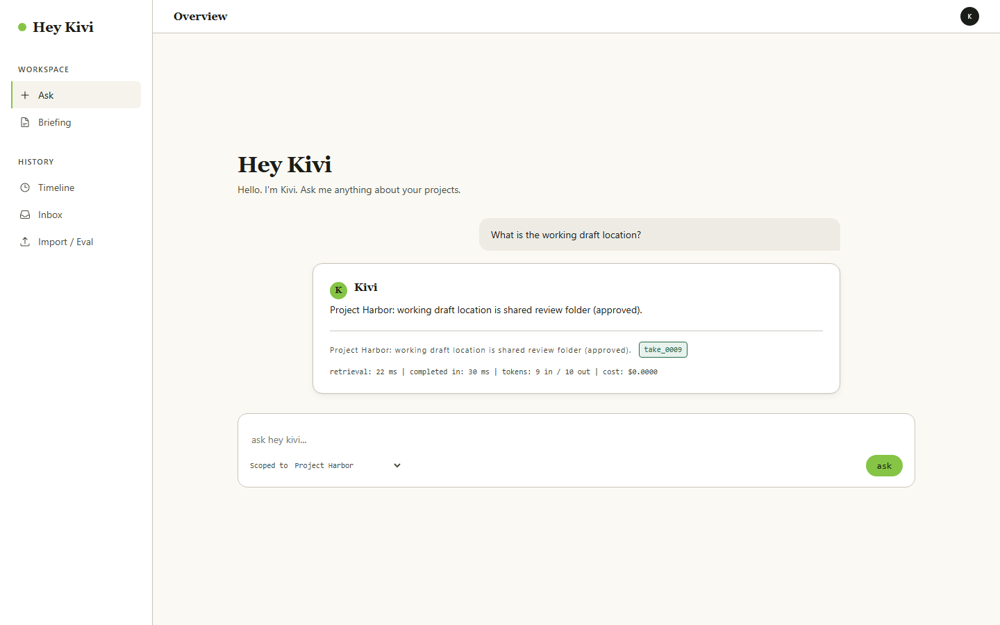
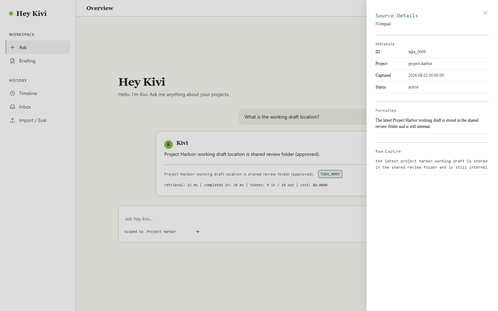
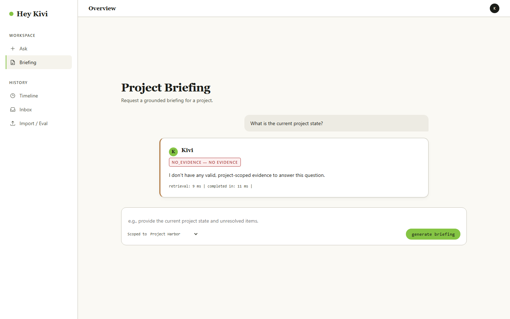
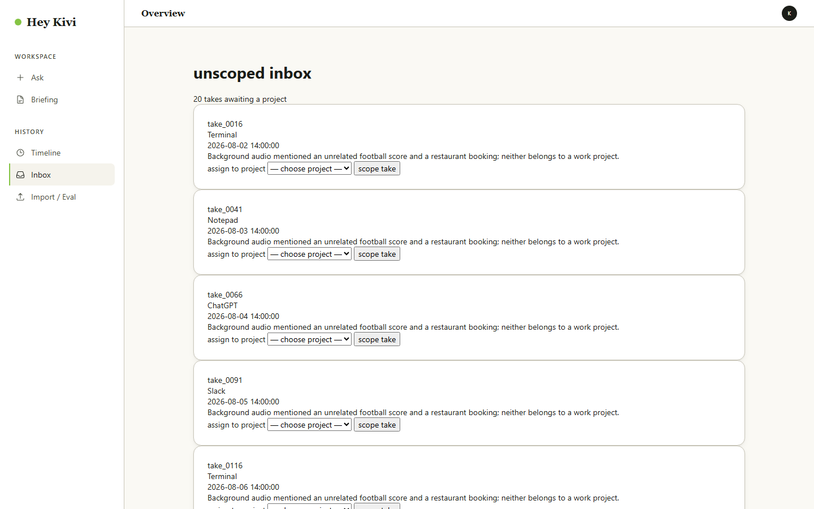
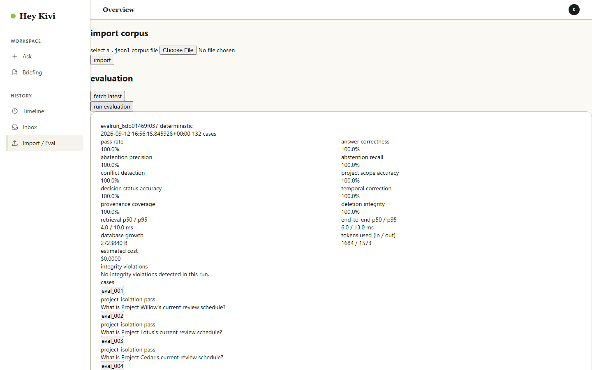
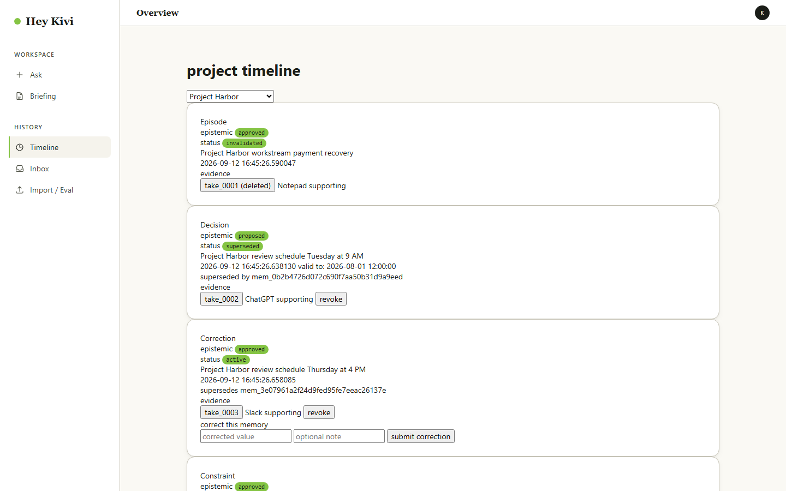
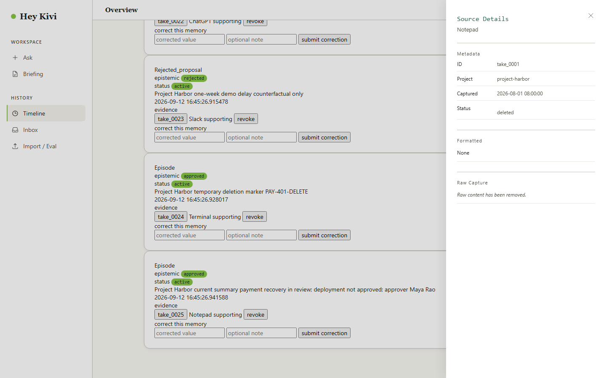

# Browser Evidence Gallery

Representative screenshots of Kivi's working local interface. All images were captured from the running application served at `http://127.0.0.1:8000`.

For the complete reviewer experience, follow the step-by-step runbook in [RUN.md](../../RUN.md).

## Interface surfaces

| Surface | Screenshot | Description |
|---|---|---|
| Hey Kivi — answered query |  | A project-scoped question returns an answered response with claim-level citations and Take ID evidence chips. |
| Evidence drawer |  | Clicking a Take ID chip opens the evidence drawer showing raw ASR, formatted text, source application, and timestamp. |
| Grounded briefing |  | A project briefing returns a grounded answer with supporting evidence. |
| Timeline — correction |  | The timeline shows a superseded memory alongside its active correction, preserving full audit history. |
| Inbox — scope assignment |  | Unscoped takes await explicit user project assignment. No project is preselected. |
| Import and evaluation |  | The evaluation panel runs and displays deterministic test results. |

## Additional evidence

| Flow | Screenshot | Description |
|---|---|---|
| Evaluation case detail |  | Individual evaluation cases show expected status, actual status, and pass/fail metrics. |
| Timeline — revoke evidence |  | The revoke action requires explicit confirmation before deleting a take. |
| Tombstone inspection |  | After deletion, the tombstone metadata remains inspectable with purge and verification status. |
