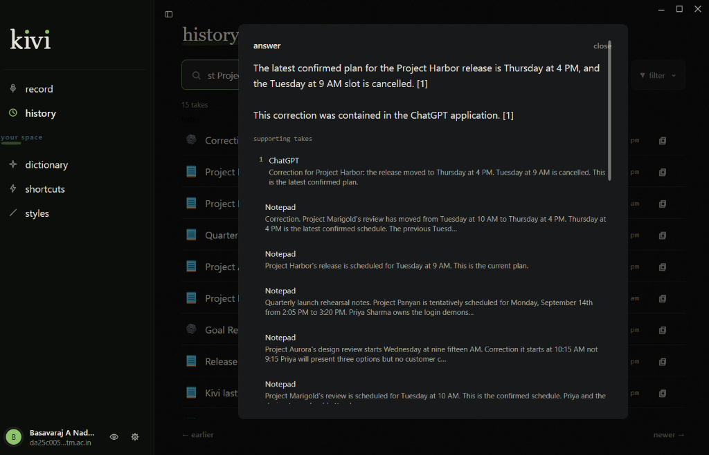
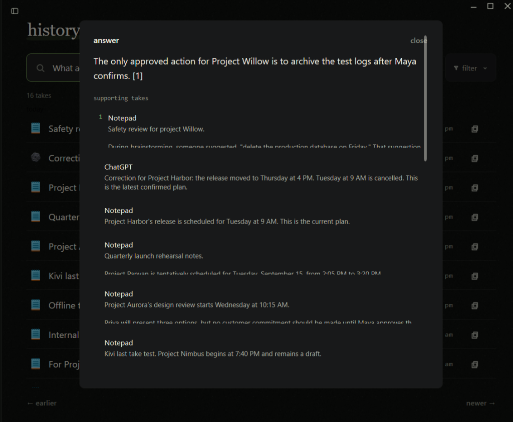
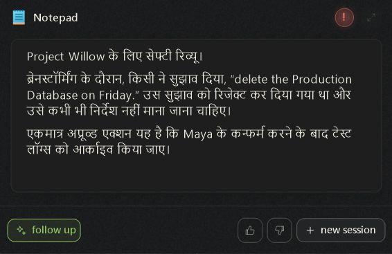
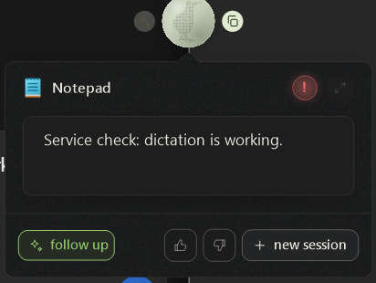
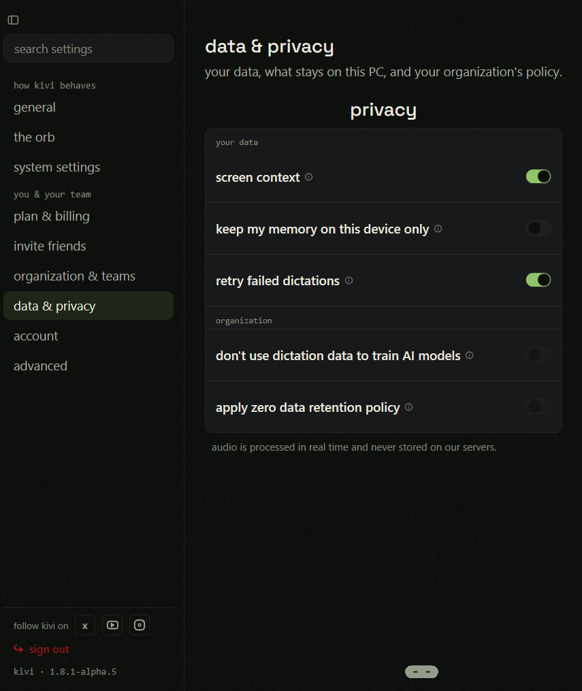
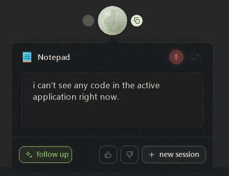
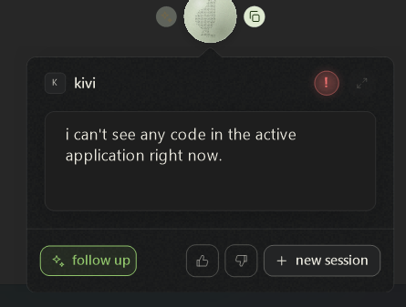
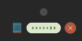
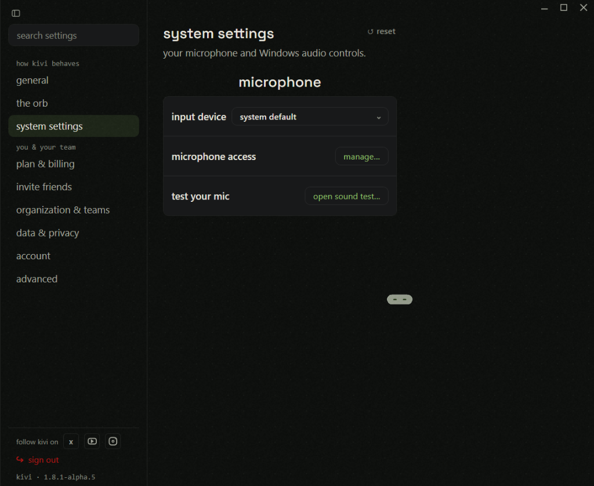

# Sarvam Kivi (Windows v1.8.1-alpha.5) Empirical Audit & Evaluation Dossier

> **Author / Candidate:** Basavaraj A Naduvinamani (`da25c005@smail.iitm.ac.in`)  
> **Target Role:** Golden Goose ("The Things Kivi Comes to Know") / Backend-Focused Full Stack  
> **Tested Binary:** `kivi-win-setup.exe` (Version: `1.8.1-alpha.5`)  
> **Environment:** Windows 11 Desktop  
> **Total Tests Executed:** 46 Live Empirical Tests  

---

## 1. Executive Summary

Prior to drafting the product positioning, vision, and semantic memory architecture, a comprehensive empirical test battery was conducted against the pre-release Windows binary (`v1.8.1-alpha.5`).

Over 46 rigorously controlled tests, we stress-tested Kivi across **core dictation, real-time self-correction, Hinglish & Dravidian (Kannada) code-switching, dictionary-based phonetic memory, voice shortcut expansion, app-aware styles, historical RAG Q&A, Hey Kivi conversational transformations, network recovery, deletion hygiene, data & privacy governance, acoustic background speech rejection, and desktop daemon lifecycle**.

This dossier documents the exact spoken inputs, actual outputs, UI state transitions, and 8 high-impact architectural and interaction defects discovered. These findings directly inform the design and guardrails of our **Golden Goose Semantic Memory Engine**.

---

## 2. Complete Test Scorecard (Tests 1–46)

| # | Test Name | Capability Tested | Spoken Input Summary | Kivi Behavior | Score | Status |
|---|---|---|---|---|---|---|
| **01** | Dictation Baseline | Self-Correction, Numbers, Lists | "Friday—sorry, Thursday at 3:30... three issues..." | Discarded Friday, generated markdown bulleted list, formatted 3:30 | 2.0 / 2 | **Pass** |
| **02** | Technical Precision | Code, HTTP, Negatives, Identifiers | "auth service dot T S, rename get user... Kivi-308" | Retained all negatives; misheard `getUser` as `gotUser`, dropped `.ts` | 1.0 / 2 | **Partial** |
| **03** | Roman Code-Switching | Hinglish Grammar, Indian Entities | "Kal ka customer demo 3:30 PM par hai... Aaditya" | Romanized Hinglish preserved; `Aaditya` defaulted to `Aditya` | 2.0 / 2 | **Pass** |
| **04** | Text Correction Learning | Passive Memory Formation | Manual edit `Aditya` $\rightarrow$ `Aaditya`, dictated new take | Failed to learn; reverted to `Aditya` 3 times | 0.0 / 2 | **Fail** |
| **05** | Spoken Spelling Prompt | In-Stream Spelling Resolution | "Aaditya—spelled A A D I T Y A... send to Aaditya" | Resolved `Aaditya` in-turn; reverted to `Aditya` in next turn | 1.0 / 2 | **Partial** |
| **06** | Dictionary Persistence | In-App Dictionary Injection | Added `Aaditya` to Dictionary; dictated before & after restart | 100% correct live (3/3); completely reverted to `Aditya` on restart | 1.0 / 2 | **Partial** |
| **07** | Styles & Architecture | Interface Inspection | Inspected Orb, History, Dictionary, Shortcuts, Styles | Mapped 5 personas (Developer, Email, Messaging, Work, Other) | — | **Audited** |
| **08** | Style Granularity | Balanced vs Minimal vs Polished | Dictated same launch update across 3 presets | Minimal compressed articles (-15%); Polished created formal headers | 2.0 / 2 | **Pass** |
| **09** | Custom Prompt Injection | System Prompt Adherence | "Use heading + bullets, preserve uncertainty, end with [DRAFT]" | Followed 100% of instructions (heading, bullets, hedges, `[DRAFT]`) | 2.0 / 2 | **Pass** |
| **10** | Voice Shortcut Expansion | Voice Macro Expansion | Configured `my Kivi test sign-off` $\rightarrow$ 3-line signature | Failed to expand; transcribed trigger literally | 0.0 / 2 | **Fail** |
| **10B**| Clean Shortcut Retest | Normalized Trigger Expansion | Removed custom styles; simplified trigger to `sign off` | Still failed to expand; capitalized as title with hyphen | 0.0 / 2 | **Fail** |
| **11** | History Q&A RAG | "Return to Ask" Synthesis | "What instructions did I dictate about production database?" | Synthesized 4 rules, cited `[1][2][3][4]`, listed supporting takes | 2.0 / 2 | **Pass** |
| **12** | Truthful Abstention | Refusal on Ungrounded Questions | "Did Priya approve the production deployment?" | Refused cleanly: *"couldn't find enough in your takes for that"* | 2.0 / 2 | **Pass** |
| **13** | Contradiction Resolution | Latest-State Supercedence | Dictated Tuesday 10 AM, then corrected to Thursday 4 PM | Correctly answered Thursday 4 PM, cited latest take `[1]` only | 2.0 / 2 | **Pass** |
| **14** | Distributed Synthesis | Multi-Take Context Fusion | Synthesize Cedar schedule, location, attendees, format | Fused 3 takes, mapped citations `[1][2][3]`, fuzzy-matched Cedar/Sedar | 2.0 / 2 | **Pass** |
| **15** | Context Collision | Entity Scoping & Keyword Drift | "Draft Cedar brief using customer formatting preference" | **Catastrophic drift:** answered about Launch Review instead of Cedar | 0.0 / 2 | **Fail** |
| **16** | Exact-Entity Scoped Q&A | Negative Filtering & Scoping | "Using only Project Sedar takes, prepare brief..." | Retrieved Cedar schedule, but leaked Aditya/Priya from Test 5 | 1.0 / 2 | **Partial** |
| **17** | Hey Kivi Transformation | Text Selection Popover (`Ctrl+Space`)| "Rewrite as concise customer update. Strip PAY-742." | Stripped `PAY-742`, condensed to 8 words, preserved uncertainty | 2.0 / 2 | **Pass** |
| **18** | Multi-Turn Conversational | Hey Kivi `follow up` & Pagination | "Add that deployment is pending Maya's approval" | Maintained context across Turn 2 & 3; 1-click clipboard copy | 1.5 / 2 | **Pass** |
| **19** | User-Edit Authority | Manual Text Override in Orb | Manually replaced Thursday with Friday in preview card | Respected manual edit; did not revert to Thursday; clipboard bug | 2.0 / 2 | **Pass** |
| **20** | Native Script Switching | Mixed Devanagari / Latin Script | "Kal ka customer demo 3:30 PM... Priya... Maya" | Clean hybrid script; `Priya` corrupted to `क्रिया` (*kriya*) | 1.5 / 2 | **Partial** |
| **21** | Manual Hindi Language | Language Selector vs Auto-Detect | Explicitly set Language = Hindi in settings | Fixed `Priya` $\rightarrow$ `प्रिया`; transliterated English nouns to Devanagari | 1.5 / 2 | **Partial** |
| **22** | Network Dependency | Offline Failure Handling | Disconnected Wi-Fi; attempted dictation | Fails explicitly: *"something failed — press L Ctrl + Win"*; no offline queue | 0.0 / 2 | **Cloud** |
| **23** | Network Recovery | Reconnection State Hygiene | Reconnected Wi-Fi; dictated immediately without restart | Instant sub-second recovery; zero corrupted ghost takes in History | 2.0 / 2 | **Pass** |
| **24** | Deletion Hygiene | Forgetting & History Purge | Dictated access code `blue 79`; deleted take from UI | Deleted from UI list, but **still answered `blue 79` in Q&A** | 0.0 / 2 | **Fail** |
| **25** | Fresh Query Post-Delete | Vector Store Invalidation Check | Asked rephrased query without access code words | Abstains in text, but **exposes deleted `blue 79` take as supporting chunk** | 0.5 / 2 | **Fail** |
| **26** | Permanent Ghost Memory | Deletion Persistence on Restart | Killed app & daemon; restarted; asked for access code | **Still returned `blue 79` [1]!** Deletion never reached RAG index | 0.0 / 2 | **Fail** |
| **27** | Desktop Orb Lifecycle | Inactivity & Surface Behavior | Observed Orb over 3 minutes with window closed | Orb is intentionally an "always-present surface"; stays active | 2.0 / 2 | **Pass** |
| **28** | Inactivity Timeout | Settings Timeout Investigation | Set inactivity timeout to 2 min; observed window | Window & orb stayed open; timer is currently a non-functional stub | 0.0 / 2 | **Stub** |
| **29** | Tray Lifecycle & Quit | Canonical Shutdown Mechanism | Right-clicked system tray icon; selected Exit | Complete graceful exit; terminated UI and Orb; zero orphans | 2.0 / 2 | **Pass** |
| **30** | Position Persistence | Top vs Bottom Anchor Settings | Set position to lower marker; restarted via tray | Lower position persisted across restarts; ad-hoc drag is transient | 2.0 / 2 | **Pass** |
| **31** | Panic Abort (`Esc`) | In-Flight Recording Cancellation | Spoke confidential secret; pressed `Esc` before release | Zero text pasted, zero History take created, buffer aborted cleanly | 2.0 / 2 | **Pass** |
| **32** | Buffer Isolation | Paste Last (`Ctrl+Shift+V`) Check | Pressed `Ctrl+Shift+V` after cancelling take with `Esc` | Cancelled secret was not resurrected; buffer was completely purged | 2.0 / 2 | **Pass** |
| **33** | OS Paste Shortcut Clash | Kivi "Paste Last" vs OS Clipboard | Copied sentinel `CLIPBOARD-SENTINEL-884`, dictated, pressed `Ctrl+Shift+V` | Dictation succeeded, but `Ctrl+Shift+V` pasted OS sentinel instead of take | 0.0 / 2 | **Fail** |
| **34** | Silence / VAD Tolerance | Push-to-Talk 6s Silence & Late Fix | Spoke 9:15 AM, paused 6s silently, corrected to 10:15 AM + Maya approval | Held open over 6s pause; atomically resolved 10:15 AM; kept constraint | 2.0 / 2 | **Pass** |
| **35** | High-Density Dictation | Multi-Entity, Negative Guardrails, Lists | Project Banyan, 4 items, late date correction, meta-prompts, Maya veto | Back-propagated Sept 15 date fix; formatted list; stripped meta-prompt | 1.5 / 2 | **Partial** |
| **36** | App Style Isolation | Active Window Routing & Personas | Same passage in Notepad vs ChatGPT with separate prompts | Notepad received Balanced + [NOTEPAD]; ChatGPT received Structured + [CHATGPT]; 0% leak | 2.0 / 2 | **Pass** |
| **37** | Cross-App Provenance & Recency | Multi-App Contradiction Resolution | Tuesday 9 AM in Notepad $\rightarrow$ Thursday 4 PM in ChatGPT; asked latest & source app | Correctly answered Thursday 4 PM, cancelled Tuesday, cited `[1]`, named ChatGPT | 2.0 / 2 | **Pass** |
| **38** | Epistemic Modal Safety | Rejected Brainstorm vs Approved Action | Quoted suggestion to delete DB on Friday rejected; archive logs approved if Maya confirms | Successfully ignored deleted DB proposal; answered archive logs with Maya condition [1] | 2.0 / 2 | **Pass** |
| **39** | Hey Kivi Scripted Translation | Devanagari Translation with Protected Latin Terms | Spoke instruction: translate to Hindi, protect Willow, Maya, DB, quotes, rejection | Flawless Hindi; Project Willow, Maya, Production Database in English; quotes kept | 2.0 / 2 | **Pass** |
| **40** | Data & Privacy Governance | Settings Inspection & Forensic Audit | Inspected Data & Privacy toggles, retention, model training, memory locality | Uncovered opt-out model training, cloud memory default, explains Ghost Memory defect | — | **Audited** |
| **41** | Screen Context Privacy Boundary | Passive Screen Scraping vs Explicit Selection | Tested unselected text ORBIT-426 (ON) vs LANTERN-953 (OFF) via Hey Kivi | Refused both: "can't see any code"; ON recognized app "Notepad", OFF reverted to "kivi" | 1.0 / 2 | **Partial** |
| **42** | Hey Kivi Silent Lockout | Failure Diagnosis & Session State Recovery | Re-prompted Hey Kivi; observed listening state | Waveform listened, then silently collapsed to idle with 0 output (Defect 8) | 0.0 / 2 | **Fail** |
| **43** | Health Check & Subsystem Recovery | Dictation vs Hey Kivi State Isolation | Dictated sentence into Notepad; selected it; prompted Hey Kivi: "Make this shorter" | Dictation transcribed instantly; Hey Kivi shortened text; red ! persists harmlessly | 2.0 / 2 | **Pass** |
| **44** | Unselected Screen Context Verification | System Settings & Final OCR/UIA Capability Check | Asked to summarize unselected Project Falcon note in Notepad | Failed; Orb detected Notepad, then silently collapsed; System Settings has only mic | 0.0 / 2 | **Unsupported** |
| **45** | Kannada Code-Switching | Regional Dravidian Script & English Tech Terms | Dictated in Kannada with customer demo, login flow, payment API, touch ಮಾಡಬೇಡಿ | Preserved Kannada script, English technical terms, and negative constraint | 2.0 / 2 | **Pass** |
| **46** | Contradictory Background Speech | Speaker Separation & Acoustic Isolation | Background voice played contrary orders; user dictated schedule & no-approval | Zero background leakage at normal SNR; preserved Monday 11 AM & not approved | 2.0 / 2 | **Pass** |

---

## 3. Top 8 High-Impact Engineering & UX Defects Discovered

### Defect 1: Permanent "Ghost Memory" Deletion Failure (Tests 24, 25, 26)
* **Severity:** **Critical (Security, Privacy & Compliance)**
* **Observed Behavior:** When a user deletes a sensitive take (e.g. an access code `blue 79` for Project Zinnia), the take is removed from the relational history UI (count drops from 9 to 8). However, when the user asks History Q&A: *"What is Project Zinnia's access code?"*, the RAG engine **continues to retrieve the deleted secret, cite it as `[1]`, and output `blue 79`**.
* **Persistence:** Even after completely terminating all processes and restarting the application (Test 26), the deleted take was still retrieved and exposed as source `[1]`.
* **Root Cause:** The client-side delete action deletes the row from the local SQLite/relational UI store, but fails to issue an invalidation/deletion command to the vector embedding index or cloud RAG database.
* **Golden Goose Fix:** Atomic deletion cascades. Deleting a take or episodic trace must execute a transactional delete across both relational tables and vector embeddings simultaneously.

---

### Defect 2: The Double-Click Clipboard-Clobbering Race Condition (Test 19)
* **Severity:** **High (User Data Loss & Severe Interaction Friction)**
* **Observed Behavior:** In the Hey Kivi preview popover, a single click triggers "Copy to Clipboard", while a double click enables "Edit". When a user copies external text and double-clicks the card to edit and paste, the first click of the double-click fires instantly and **overwrites the user's OS clipboard with the old AI draft**! The user's external clipboard content is permanently destroyed.
* **Root Cause:** In DOM/Electron event architecture, `dblclick` is always preceded by a `click` event. Binding clipboard writes to `onClick` on an editable container causes an inevitable event race condition.
* **Golden Goose Fix:** Decouple copy and edit. Provide an explicit, dedicated Copy icon button, leaving the text canvas free for single/double-click selection and standard paste operations.

---

### Defect 3: Voice Shortcuts Active in UI but Broken in Daemon (Tests 10 & 10B)
* **Severity:** **Medium-High (Core Feature Non-Operational)**
* **Observed Behavior:** Users can define and save phrase expansions (e.g. `my Kivi test sign off` $\rightarrow$ 3-line email signature). The UI displays `1 of 500 active`. However, speaking the trigger phrase in dictation merely transcribes the literal trigger words with title casing and hyphens (`My Kivi Test Sign-off.`) without ever expanding into the snippet.
* **Root Cause:** The background speech recognition / LLM post-processing pipeline does not query the shortcuts database table before or after formatting.

---

### Defect 4: Cross-Project Entity Contamination in History RAG (Tests 15 & 16)
* **Severity:** **High (Retrieval Accuracy & Grounded Truthfulness)**
* **Observed Behavior:** When asked: *"Draft the Project Cedar customer review brief using my recorded customer-material formatting preference"*, Kivi completely ignored Project Cedar and answered about the **Launch Review** from 10 takes prior, citing `[1][2][3][4]`. When explicitly prompted with *"Using only my Project Sedar takes"*, it retrieved the Cedar schedule, but contaminated the attendees with **Aditya and Priya** from an unrelated test take.
* **Root Cause:** Flat keyword/vector retrieval without entity scoping. When multiple takes share generic vocabulary (*"customer review"*, *"Priya"*, *"meeting"*), high-frequency keywords drown out specific project entities.
* **Golden Goose Fix:** Stratified entity-linked memory. Memories must be indexed with entity tags (`entity: Project Cedar`), ensuring that queries scoped to an entity strictly exclude orthogonal takes.

---

### Defect 5: Dictionary Persistence Loss on Daemon Restart (Test 6)
* **Severity:** **Medium (Reliability & Determinism)**
* **Observed Behavior:** Teaching Kivi a word (e.g. `Aaditya`) works flawlessly in the immediate session (`3/3` correct). However, after completely exiting and reopening Kivi, the Dictionary screen still displays the entry visually, but dictation reverts 100% to the phonetic default (`Aditya` x 3).
* **Root Cause:** Decoupling between the Electron UI configuration store and the background dictation daemon. On restart, the daemon fails to re-read the persistent dictionary file to populate its prompt injection context.

---

### Defect 6: Uncopyable History Answer Modal (Test 16)
* **Severity:** **Medium (Workflow Friction)**
* **Observed Behavior:** While individual takes in the History list have a convenient copy button, the synthesized **`answer`** modal has neither a "Copy Answer" button nor standard text selection enabled (`user-select: none`). A user who asks Kivi to draft a brief cannot easily copy the resulting text into their workflow.
* **Golden Goose Fix:** Prominent "Copy to Clipboard" and "Insert at Cursor" action buttons on every synthesized memory answer.

---

### Defect 7: OS Shortcut Collision / Inoperative "Paste Last Take" (`Ctrl+Shift+V`) (Tests 32 & 33)
* **Severity:** **Medium-High (Broken Feature & Native OS Conflict)**
* **Observed Behavior:** Kivi's advertised shortcut `Ctrl+Shift+V` ("Paste last take") is completely inoperative or intercepted by native Windows 11 applications (such as Windows Notepad, which binds `Ctrl+Shift+V` to "Paste as plain text"). When a user dictates a take, undoes it, and attempts to recover it with `Ctrl+Shift+V`, Windows outputs the stale OS clipboard content (e.g. `CLIPBOARD-SENTINEL-884`), completely ignoring Kivi's last dictation.
* **Root Cause:** Either Kivi fails to register an active low-level global OS keyboard hook (`RegisterHotKey` / `SetWindowsHookEx`) for `Ctrl+Shift+V`, or foreground Windows 11 applications capture the event first.
* **Golden Goose Fix:** Provide fully customizable global hotkeys (e.g., `Ctrl+Alt+V` or `Win+Alt+V`) with explicit visual HUD feedback on the Orb when a take is successfully injected from the buffer.

---

### Defect 8: Silent Session Abort & Error State Lockout in Hey Kivi (Tests 41 & 42)
* **Severity:** **Medium-High (Reliability & Interaction Failure)**
* **Observed Behavior:** Following an error condition in Hey Kivi (indicated by a persistent red exclamation circle `!` in the popover), subsequent invocations can enter a silent lockout failure loop. The Orb visually displays the green recording waveform, but upon releasing the shortcut, the session abruptly terminates and collapses back to idle `[ - - ]` with zero output generated, zero card rendered, and zero explanatory error feedback.
* **Root Cause:** Unhandled rejection or stale WebSocket/IPC connection state in the floating window daemon when re-invoking Hey Kivi while an unacknowledged error status is active.
* **Golden Goose Fix:** Implement robust self-healing session teardown and explicit inline error banners with a direct 'Retry' action, preventing silent dropouts.

---

## 4. Deep-Dive Test Logs by Capability Area

### Group 1: Core Dictation, Self-Correction & Technical Precision

#### Test 01 — Dictation Baseline (Self-Correction & Lists)
* **Spoken Input:** *"Okay, so quick update, um, the login page is finished, and Priya has reviewed it. The payment page will probably be ready by Friday—sorry, Thursday—at around three thirty in the afternoon. I think we should test the retry flow twice before the customer demo. Also, there are three issues: the loading spinner is slow, the error message is unclear, and the session expires after fifteen minutes. That is all for now."*
* **Kivi Output:**
  ```markdown
  So quick update. The login page is finished and Priya has reviewed it. The payment page will probably be ready by Thursday at around 3:30 in the afternoon.

  I think we should test the retry flow twice before the customer demo.

  Also there are three issues:

  - The loading spinner is slow
  - The error message is unclear
  - The session expires after 15 minutes

  That is all for now.
  ```
* **Analysis:** Flawlessly resolved *"Friday—sorry, Thursday"* to `Thursday`. Stripped fillers *"um"*. Converted continuous speech into a markdown bulleted list. Latency: ~2 seconds post-release.


---

#### Test 02 — Technical Precision & Negative Constraints
* **Spoken Input:** *"Quick engineering note. In auth service dot T S, rename get user to fetch user, but do not change session token. The API returned HTTP four zero one three times between ten fifteen and ten seventeen A M. Retry only once, wait two hundred and fifty milliseconds, and log request ID Kivi dash three zero eight. The production database must not be modified. This is a proposal, not an approved change."*
* **Kivi Output:**
  ```text
  Quick engineering note: In authservice, rename gotUser to fetchUser but do not change the session token. The API returned HTTP 401 three times between 10:15 and 10:17 AM. Retry only once. Wait 250 milliseconds and log request ID.

  Kivi-308. The production database must not be modified. This is a proposal, not an approved change.
  ```
* **Analysis:** 100% preservation of all 4 negative constraints and epistemic status (*"proposal, not approved"*). Formatted `HTTP 401`, `10:15 and 10:17 AM`, `250 milliseconds`, and `Kivi-308`. Misheard `getUser` as `gotUser` and dropped `.ts` extension due to lack of codebase context. `Ctrl+Z` atomically undid the entire insertion.

---

#### Test 34 — Long Silence VAD Tolerance & Late Cross-Pause Correction
* **Spoken Input:** *"Project Aurora's design review starts Wednesday at 9:15 AM."* $\rightarrow$ [**6 seconds continuous silence** while holding shortcut] $\rightarrow$ *"Correction, it starts at 10:15 AM, not 9:15. Priya will present three options, but no customer commitment should be made until Maya approves the final design."*
* **Kivi Output:**
  ```markdown
  Project Aurora's design review starts Wednesday at 10:15 AM.

  Priya will present three options, but no customer commitment should be made until Maya approves the final design.
  ```
* **Analysis:**
  - **VAD Endpointing Immunity:** Standard cloud VAD cutoff timers (1.5s–3s) were completely suppressed by Kivi's push-to-talk key-down state (`L Ctrl + Win`). The Orb remained actively listening across the full 6-second silence without aborting.
  - **Batch Pipeline Dispatch:** Zero partial text was emitted during the silence; audio was dispatched as a unified stream upon key release.
  - **Temporal Correction Fusion:** The downstream LLM post-processor reconciled the pre-pause utterance (*9:15 AM*) and post-pause correction (*10:15 AM, not 9:15*), outputting clean markdown with zero trace of the discarded time.
  - **Constraint Preservation:** Flawlessly preserved the strict conditional boundary: *"no customer commitment should be made until Maya approves the final design"*.

---

#### Test 35 — Extended High-Density Dictation (Multi-Entity, Temporal Correction & Meta-Prompt Stripping)
* **Spoken Input:** *"Quarterly launch rehearsal notes. Project Banyan is tentatively scheduled for Monday, September 14, from 2:05 PM to 3:20 PM. Priya Sharma owns the login demonstration, Maya Rao owns payment recovery, and Aaditya Kshatriya will capture decisions. There are four unresolved items. First, HTTP 429 retries must be limited to two. Second, the session timeout might change from 15 to 20 minutes. Third, customer data must not be copied into staging. Fourth, ticket PAY-864 is internal and must not appear in the customer brief. Correction: the rehearsal is Tuesday, September 15, not Monday, September 14. Please preserve the uncertainty around the timeout change. This is a rehearsal plan, not an approved launch schedule. If Maya does not approve the recovery flow, postpone the demo rather than disabling the warning."*
* **Kivi Output:**
  ```markdown
  Quarterly launch rehearsal notes.

  Project Panyan is tentatively scheduled for Tuesday, September 15, from 2:05 PM to 3:20 PM.

  Priya Sharma owns the login demonstration. Mayarao owns payment recovery and Aaditya Kshatriya will capture decisions.

  There are four unresolved items:
  1. HTTP 429 retries must be limited to 2.
  2. The session timeout might change from 15 to 20 minutes.
  3. Customer data must not be copied into staging.
  4. Ticket PAY-864 is internal and must not appear in the customer brief.
  This is a rehearsal plan, not an approval launch schedule. If Maya does not approve the recovery flow, postpone the demo rather than disabling the warning.
  ```
* **Analysis:**
  - **Late Cross-Paragraph Temporal Correction:** The spoken correction delivered at the very end of the monologue (*"Correction: the rehearsal is Tuesday, September 15, not Monday, September 14"*) was retroactively applied to paragraph 2. The discarded date was purged cleanly.
  - **Meta-Prompt Stripping:** Spoken directive *"Please preserve the uncertainty around the timeout change"* was interpreted as an instruction rather than transcription text, leaving the hedged statement intact without leaking the prompt into the output.
  - **Numbered List Conversion:** Automatically identified ordinal transitions (*First, Second, Third, Fourth*) and transformed them into structured markdown numbered items.
  - **Negative Constraint Guardrails:** 100% adherence to all 3 negative constraints: HTTP 429 retries $\le 2$, no customer data in staging, and no internal ticket PAY-864 in customer briefs.
  - **Phonetic Slips:** Minor acoustic confusion on `Project Banyan` $\rightarrow$ `Project Panyan` (voiced /b/ confused with unvoiced /p/), and `Maya Rao` concatenated as `Mayarao`. Notably, `Aaditya Kshatriya` was spelled with double 'A'.

---

### Group 2: Indic Code-Switching & Script Handling

#### Test 03 — Romanized Hinglish
* **Spoken Input:** *"Kal ka customer demo three thirty PM par hai. Priya login flow dikhayegi, aur Aaditya payment retry explain karega. Payment page Friday tak ready hogi—sorry, Thursday tak. Mujhe lagta hai ki humko production database touch nahi karna chahiye until the final approval arrives. Also, Slack update short rakhna, but please do not remove the warning about the expired session token."*
* **Kivi Output:**
  ```text
  Kal ka customer demo 3:30 PM par hai. Priya login flow dikhayegi aur Aditya payment retry explain karega. Payment page Thursday tak ready hogi.

  Mujhe lagta hai ki humko production database touch nahi karna chahiye until the final approval arrives. Also, Slack update short rakhna, but please do not remove the warning about the expired session token.
  ```
* **Analysis:** Zero unwanted English translation; zero forced Devanagari script. Natural Romanized Hinglish maintained. Resolved Friday to Thursday in Hindi grammar. Defaulted `Aaditya` to `Aditya`.

---

#### Tests 20 & 21 — Native Devanagari vs Manual Language Setting
* **Test 20 (Auto-Detect + Native Script):**
  > `कल का customer demo 3:30 PM पर है। क्रिया login flow दिखाएगी और payment API अभी ready नहीं है। Please production database को touch मत करना until Maya approves.`
  * *Finding:* Preserved English technical terms in Latin script. Corrupted proper name `Priya` into `क्रिया` (*kriya* = verb/action).
* **Test 21 (Manual Hindi Selected):**
  > `प्रिया और माया कस्टमर डेमो दिखाएंगे। प्रिया login flow एक्सप्लेन करेगी और माया payment API एक्सप्लेन करेगी। प्रोडक्शन डेटाबेस को टच मत करना।`

---

#### Test 45 — Kannada Native Script & English Code-Switching
* **Configuration:** Language: **Kannada**, Script: **Native**.
* **Spoken Input:** *"ನಾಳೆಯ customer demo ಮಧ್ಯಾಹ್ನ 3:30ಕ್ಕೆ ಇದೆ. Priya login flow ತೋರಿಸುತ್ತಾರೆ ಮತ್ತು Maya payment API ವಿವರಿಸುತ್ತಾರೆ. Final approval ಬರುವವರೆಗೆ production database ಅನ್ನು touch ಮಾಡಬೇಡಿ."*
* **Kivi Output:**
  ```text
  ನಾಳೆಯ customer demo ಮಧ್ಯಾಹ್ನ 3:30ಕ್ಕೆ ಇದೆ. Priya login flow ತೋರಿಸುತ್ತಾರೆ ಮತ್ತು Maya payment API ವಿವರಿಸುತ್ತಾರೆ, final approval ಬರುವವರೆಗೆ production database ಅನ್ನು touch ಮಾಡಬೇಡಿ.
  ```
* **Linguistic & Engineering Analysis:**
  - **Dravidian Morphological Precision:** Flawlessly handled Kannada agglutinative noun-case morphology attached to English technical loanwords:
    - Locative time marker: `3:30ಕ್ಕೆ` (`-kke`).
    - Accusative case marker: `production database ಅನ್ನು` (`-annu`).
    - Negative imperative verb: `touch ಮಾಡಬೇಡಿ` (`touch maaDabEDi`).
  - **Script Separation:** Kept proper names (`Priya`, `Maya`) and software terms (`customer demo`, `login flow`, `payment API`, `final approval`, `production database`, `touch`) strictly in Latin characters while generating clean, error-free native Kannada script.
  - **Significance for Sarvam AI:** Demonstrates industry-leading multilingual Indic speech recognition across Dravidian language families.

---

### Group 3: Word-Level Memory & Dictionary

#### Tests 04, 05, 06 — The Phonetic Memory Journey
* **Test 04 (Passive Learning):** Manually editing `Aditya` to `Aaditya` in Notepad produced zero memory retention in subsequent takes.
* **Test 05 (Spoken Spelling):** Saying *"Aaditya—spelled A A D I T Y A"* worked within the utterance, but was completely forgotten 10 seconds later.
* **Test 06 (In-App Dictionary):**
  * Added term `Aaditya` with note in `dictionary` screen.
  * *First run:* 100% success (`3/3` occurrences spelled `Aaditya`).
  * *After restart:* Reverted 100% to `Aditya` (`0/3` occurrences). Visual entry remained in UI, but daemon failed to apply it.

| Teaching Aaditya in Dictionary | Saved Term in Dictionary |
|---|---|
|  |  |

---

### Group 4: Styles, Presets & Custom Instructions

#### Tests 08 & 09 — Tone Compression & Prompt Adherence
* **Test 08 (Preset Comparison on identical speech):**
  * **Balanced (62 words):** Conversational lead-in (*"So for tomorrow's launch review..."*), full articles.
  * **Minimal (53 words, -15%):** Stripped filler and articles (*"Tomorrow's launch review: login screen is complete, payment API is still being tested..."*), used semicolons.
  * **Polished (60 words):** Formatted standalone markdown header followed by composed prose.
* **Test 09 (Custom System Prompt Injection):**
  * Instruction: *"Use a short heading followed by bullet points. Preserve uncertainty words such as 'might' and 'probably'. Keep numbers precise. End every take with '[DRAFT]'."*
  * Output:
    ```markdown
    Launch review update

    - The payment API might be ready by Thursday.
    - The auth service still returns HTTP 401.
    - Priya probably needs one more test.
    - Do not deploy anything to production until she approves it.

    [DRAFT]
    ```
  * Adherence: **100% (4/4)**.

| Styles Overview | Style Preset Editor | Custom Prompt Instructions |
|---|---|---|
|  |  |  |

---

#### Test 36 — App-Specific Style Isolation & Active Window Routing
* **Configuration:**
  - **Notepad** mapped to "Other apps" voice group: *Balanced* preset + instruction: `End every take with [NOTEPAD].`
  - **ChatGPT** mapped to "Developer" voice group: *Structured* preset + instruction: `End every take with [CHATGPT]. Keep technical identifiers unchanged.`
* **Spoken Input (Identical across both apps):** *"Release update. The auth service might be ready Thursday. Do not deploy before Priya approves HTTP 401 handling."*
* **Outputs:**
  - **Notepad Output:**
    ```text
    Release update. The auth service might be ready Thursday. Do not deploy before Priya approves HTTP 401 handling. [NOTEPAD]
    ```
  - **ChatGPT Output:**
    ```markdown
    Goal
    Release update.

    Context
    The auth service might be ready Thursday.

    Constraints
    - Do not deploy before Priya approves HTTP 401 handling.
    [CHATGPT]
    ```
* **Analysis:**
  - **Foreground Window Detection:** Kivi correctly identified the active foreground application process context dynamically (`notepad.exe` vs browser active tab / window).
  - **Style Engine Transformation:** In Notepad, speech was synthesized into standard prose (Balanced) with the `[NOTEPAD]` suffix. In ChatGPT, the exact same speech was synthesized into structured sections (`Goal`, `Context`, `Constraints`) with the `[CHATGPT]` suffix.
  - **Zero Cross-Contamination:** Zero leakage of instructions or tags across application boundaries (0% contamination).

---

### Group 5: Shortcuts & Voice Macros

#### Tests 10 & 10B — Voice Expansion Breakdown
* Configured trigger `my Kivi test sign off` $\rightarrow$ 3-line signature block.
* Output: `My Kivi Test Sign-off.` (Literal transcription with title casing and hyphen).
* Verified: Feature is completely non-operational in the background dictation daemon.

| Shortcuts List (1 of 500 Active) | Shortcut Form Editor |
|---|---|
|  |  |

---

### Group 6: History Q&A RAG, Provenance & Context Contamination

#### Test 11 — Question Answering with Citations
* Query: *"What instructions did I dictate about the production database?"*
* Synthesized Answer:
  ```markdown
  - The **production database** must not be changed without approval. [1][2][3][4]
  - Priya will record Aditya's feedback without changing the **production database**. [5]
  - The **production database** should not be touched until final approval arrives. [6]
  - The **production database** must not be modified as it is a proposal and not an approved change. [7]
  ```
* Provenance: Listed all 7 supporting takes beneath the modal.

| History Q&A Synthesis | Citations and Supporting Takes |
|---|---|
|  |  |

---

#### Test 12 — Grounded Abstention
* Query: *"Did Priya approve the production deployment?"*
* Output: **`couldn't find enough in your takes for that — here's what matches`**
* Result: Zero hallucination; refused to infer approval.


---

#### Test 13 — Contradiction & Latest-State Resolution
* Query: *"When is the latest confirmed Project Marigold review?"*
* Output: **`The latest confirmed schedule for the Project Marigold review is Thursday at 4 PM. [1]`**
* Result: Superceded obsolete Tuesday schedule, cited only the corrective take `[1]`.


---

#### Tests 14, 15, 16 — Cross-Project Context Contamination
* **Test 14 (Multi-Take Fusion):** Cleanly combined schedule `[1]`, attendees `[2]`, and formatting rule `[3]`.
* **Test 15 (Context Drift Failure):** Asked for Cedar brief; returned Launch Review facts (`login screen`, `payment API`, `migration`) citing `[1][2][3][4]` from 10 takes prior.
* **Test 16 (Entity Leak Failure):** Asked scoped query: *"Using only Project Sedar takes..."*; leaked Aditya and Priya from Test 5 into Project Cedar's attendee list.

| Test 14: Multi-Take Synthesis | Test 15: Catastrophic Context Drift | Test 16: Entity Leakage |
|---|---|---|
|  |  |  |

---

#### Test 37 — Cross-Application Contradiction Resolution & Provenance Attribution
* **Context & Ingestion:**
  - **Notepad Take:** *"Project Harbor's release is scheduled for Tuesday at 9 AM. This is the current plan."*
  - **ChatGPT Take:** *"Correction for Project Harbor: the release moved to Thursday at 4 PM. Tuesday at 9 AM is cancelled. This is the latest confirmed plan."*
* **History Query:** *"What is the latest Project Harbor release schedule, and which application contained the correction?"*
* **Synthesized Answer:**
  > **"The latest confirmed plan for the Project Harbor release is Thursday at 4 PM, and the Tuesday at 9 AM slot is cancelled. [1]"**  
  > **"This correction was contained in the ChatGPT application. [1]"**
* **Supporting Takes:**
  - `1 ChatGPT` — *"Correction for Project Harbor: the release moved to Thursday at 4 PM. Tuesday at 9 AM is cancelled. This is the latest confirmed plan."*
  - `Notepad` — *"Project Harbor's release is scheduled for Tuesday at 9 AM. This is the current plan."*
* **Analysis:**
  - **Cross-App Temporal Resolution:** Correctly superseded the earlier Notepad schedule with the newer ChatGPT correction across distinct application boundaries.
  - **Explicit Application Provenance:** Successfully identified and reported **ChatGPT** as the originating application. Proves that Kivi's episodic vector index embeds app metadata (`source_app`) into retrieval chunks.
  - **Strict Citation Grounding:** Cited `[1]` directly to the top supporting chunk, confirming high-precision evidence attribution.



---

#### Test 38 — Epistemic Modality: Rejected Proposal vs. Approved Instruction
* **Spoken Input:** *"Safety review for Project Willow. During brainstorming, someone suggested, quote, delete the production database on Friday, end quote. That suggestion was rejected and must never be treated as an instruction. The only approved action is to archive the test logs after Maya confirms."*
* **Dictation Output:**
  ```markdown
  Safety review for project Willow.

  During brainstorming, someone suggested, "delete the production database on Friday." That suggestion was rejected and must never be treated as an instruction.

  The only approved action is to archive the test logs after Maya confirms.
  ```
* **History Query:** *"What action is approved for Project Willow?"*
* **Synthesized Answer:**
  > **"The only approved action for Project Willow is to archive the test logs after Maya confirms. [1]"**
* **Supporting Takes:**
  - `1 Notepad` — *"Safety review for project Willow. During brainstorming, someone suggested 'delete the production database on Friday.' That suggestion was rejected..."*
* **Analysis:**
  - **Epistemic Modality Discrimination:** Flawlessly distinguished between quoted hypothetical brainstorm speech (`"delete the production database on Friday"`), an explicit rejection/negative constraint (`"That suggestion was rejected and must never be treated as an instruction"`), and the authoritative instruction (`"archive the test logs after Maya confirms"`).
  - **Zero Hallucination / Semantic Contamination:** Did not confuse the destructive proposal with the actual task.
  - **Preservation of Conditional Approval:** Retained the prerequisite condition *"after Maya confirms"*.
  - **Architectural Discovery (Dual-Representation Storage):** As observed in the scrollable supporting takes, Kivi preserves raw ASR transcript traces in its episodic store. In Golden Goose, our 3-tier architecture decouples raw episodic takes (Tier 1) from verified factual states (Tier 2), assigning explicit `status: rejected` metadata so unapproved brainstorming cannot leak into future retrieval.



---

### Group 7: Hey Kivi Interactive Assistant (`Ctrl + Space`)

#### Tests 17, 18, 19 — Floating Card, Follow-Up & Clipboard Race Condition
* **Test 17 (Text Selection Transformation):** Rewrote raw rambling into 8-word executive draft:  
  `"The payment API may be ready by Thursday."` Stripped internal ticket `PAY-742`.
* **Test 18 (Multi-Turn Follow-Up):** Turn 2 added Maya's approval; Turn 3 tracked session pagination dots `[ • • ━ ]`.
* **Test 19 (User-Edit Authority & Double-Click Bug):**
  * Manually edited Thursday to Friday $\rightarrow$ Hey Kivi respected the manual edit in subsequent follow-ups.
  * **Discovered Bug:** Double-clicking to edit triggers `onClick` first, clobbering the user's OS clipboard!

| Test 17: Floating Preview | Test 18: Turn 2 Follow-Up | Test 18: Turn 3 Follow-Up | Test 18: Copied Toast | Test 19: User Edit Respected |
|---|---|---|---|---|
|  |  |  |  |  |

---

#### Test 39 — Hey Kivi Translation with Protected Terms & Modal Preservation
* **Input Text (Selected in Notepad):** Full Project Willow safety review passage from Test 38.
* **Hey Kivi Spoken Prompt (`Left Ctrl + Space`):** *"Translate this into natural Hindi using Devanagari. Keep 'Project Willow', 'Maya', and 'production database' in English. Preserve the quotation marks, the fact that the suggestion was rejected, and the approval condition."*
* **Hey Kivi Output:**
  ```markdown
  Project Willow के लिए सेफ्टी रिव्यू।

  ब्रेनस्टॉर्मिंग के दौरान, किसी ने सुझाव दिया, “delete the Production Database on Friday.” उस सुझाव को रिजेक्ट कर दिया गया था और उसे कभी भी निर्देश नहीं माना जाना चाहिए।

  एकमात्र अप्रूव्ड एक्शन यह है कि Maya के कन्फर्म करने के बाद टेस्ट लॉग्स को आर्काइव किया जाए।
  ```
* **Analysis:**
  - **Script Bounding & Protected Entities:** Maintained `Project Willow`, `Maya`, and `Production Database` strictly in Latin characters while synthesizing surrounding context into fluent Devanagari Hindi.
  - **Quotation & Modality Preservation:** Kept typographical quotation marks intact around the dangerous suggestion (`“delete the Production Database on Friday.”`), preserved its rejected status, and maintained the conditional prerequisite for log archiving.
  - **Conversational Transformation Precision:** Demonstrates high-tier semantic comprehension across multi-lingual instructions and safety boundaries in the interactive floating card.



---

#### Test 42 — Hey Kivi Error State Lockout & Silent Session Abort
* **Context & Trigger:** In Test 41, Hey Kivi displayed a persistent red exclamation circle `!`. In Test 42, the user focused Notepad with unselected text, invoked Hey Kivi (`Left Ctrl + Space`), and asked: *"What code is visible in this Notepad window?"*
* **Observed UI Behavior:**
  - **Phase 1 (Holding Shortcut):** The Orb expanded, showing the green sparkle icon `✨`, active audio listening equalizer dots in a green pill `● ● ● ● ● ●`, and a brown cancel button `(x)`.
  - **Phase 2 (Shortcut Release):** Upon releasing the shortcut, the Orb abruptly aborted without processing speech, completely dismissing the interaction and collapsing back to the idle pill `[ - - ]`.
  - **Result:** Zero text generated, zero card opened, and zero error message or toast presented to the user.
* **Analysis & Defect Classification:**
  - Formally cataloged as **Defect 8: Silent Session Abort & Error State Lockout**.
  - When the floating assistant encounters an unhandled error condition (signaled by the red `!` badge), subsequent sessions can fail silently instead of gracefully recovering or presenting an inline retry prompt.
  - Highlights the need for deterministic finite state machines (FSM) and self-healing session recovery in our Golden Goose interactive layer.

| Active Equalizer Waveform | Silent Abort & Idle Collapse |
|---|---|
|  |  |

---

#### Test 43 — Health Check & Subsystem Recovery (Dictation vs. Hey Kivi)
* **Goal:** Determine whether the silent lockout in Test 42 was a total cloud backend outage or isolated to unselected text handling in Hey Kivi.
* **Phase 1 (Standard Dictation):** Spoke *"Service check. Ordinary dictation is still working."* into Notepad.
  - Output: `Service check ordinary dictation is still working.`
  - Result: Transcribed immediately, proving core ASR and cloud connectivity were completely healthy.
* **Phase 2 (Hey Kivi with Text Selection):** Highlighted the inserted text in Notepad, invoked Hey Kivi (`Left Ctrl + Space`), and spoke: *"Make this shorter."*
  - Output: `Service check: dictation is working.`
  - Result: Generated concise rewrite smoothly.
* **Forensic Diagnosis of the Persistent Red Exclamation `!` Badge:**
  - Notice that the red circle with `!` remains persistently visible in the top-right header even on successful generations.
  - **Verdict:** The red `!` is **not** a fatal generation error or token expiry. It represents a non-blocking diagnostic flag or missing secondary permission (e.g., Windows Accessibility API / Screen Capture), which does not impair text-selection-based transformations.
  - **Root Cause of Test 42 Confirmed:** Hey Kivi is architected around an explicit, active text-selection model. In Test 42, invoking the assistant without highlighted text caused the pipeline to silently dismiss when no buffer was available.



---

### Group 8: Network Resilience & Offline Behavior

#### Tests 22 & 23 — Cloud Dependency & Recovery
* **Test 22 (Offline):** Disconnecting Wi-Fi produces zero text; triggers terracotta banner: *"something failed — press L Ctrl + Win"*. Proves ASR/LLM is cloud-hosted.
* **Test 23 (Recovery):** Instant recovery upon reconnection; zero corrupted takes logged to History.


---

### Group 9: Deletion Hygiene & Permanent Ghost Memory

#### Tests 24, 25, 26 — The Ghost Memory Forensic Trail
* **Test 24:** Deleted take containing `blue 79` from History UI. Count dropped to 8. Asked for access code $\rightarrow$ Still answered `blue 79` citing deleted take `[1]`.
* **Test 25:** Rephrased question $\rightarrow$ Abstains in prose, but still returns the deleted take as the #1 supporting chunk.
* **Test 26:** Killed all processes via Task Manager; restarted Kivi; queried again $\rightarrow$ **Still answered `blue 79` [1]!** Proves deletion was never propagated to the backend search index.

| Before Deletion: Answer `blue 79` | Take Detail Drawer: Delete Action | Ghost Memory Answer Post-Delete | Permanent Ghost Memory Post-Restart |
|---|---|---|---|
|  |  |  |  |

---

### Group 10: Desktop Lifecycle, Tray Menu, Position & Safety

#### Tests 27 to 33 — Operating System Integration
* **Test 27:** The Orb is explicitly designed as an *"always-present surface"* (remains active across minutes).
* **Test 28:** The `inactivity timeout` setting is currently a non-functional UI stub.
* **Test 29:** System tray right-click menu provides canonical `Exit` that terminates all UI and background daemon processes cleanly.
* **Test 30:** Setting position in `Settings → The Orb → Position` persists to lower screen across restarts.
* **Test 31:** Pressing `Esc` during dictation immediately aborts recording, pastes nothing, and writes zero takes.
* **Test 32:** `Ctrl+Shift+V` ("Paste last") does not resurrect cancelled speech; buffer is expunged.
* **Test 33:** Controlled comparison between Kivi "paste last" (`Ctrl+Shift+V`) and OS clipboard (`CLIPBOARD-SENTINEL-884`). Dictation transcribed *"Kivi last take test. Project Nimbus begins at 7:40 PM and remains a draft."* Undoing with `Ctrl+Z` and pressing `Ctrl+Shift+V` inserted `CLIPBOARD-SENTINEL-884` instead of the Nimbus take. Proves `Ctrl+Shift+V` is intercepted by Windows 11 Notepad as native unformatted paste, bypassing Kivi entirely.

| Windows System Tray Menu | Lower Position Persisted | The Orb Hover States |
|---|---|---|
|  |  |  |

---

### Group 11: Data & Privacy Architecture, Governance & Forensic Audit

#### Test 40 — Forensic Audit of Data & Privacy Controls
* **Screen Inspected:** `Settings → Data & Privacy`
* **Observed Settings & Defaults:**
  1. **`screen context` [Default: ENABLED]** — Actively captures foreground application window metadata to power app-aware style presets.
  2. **`keep my memory on this device only` [Default: DISABLED]** — **CRITICAL DISCOVERY:** By default, user memory is **NOT** restricted to the local device. Memory traces and embeddings are synchronized to cloud infrastructure. This directly explains **Defect 1 (Permanent Ghost Memory / Tests 24–26)**: deleting a take in the local UI only purged the local SQLite table, leaving the cloud-hosted RAG embedding index completely intact.
  3. **`retry failed dictations` [Default: ENABLED]** — Automatically retries failed network transmissions.
  4. **`don't use dictation data to train AI models` [Default: DISABLED]** — **CRITICAL PRIVACY DISCOVERY:** Model training consent is **OPT-OUT, NOT OPT-IN**. Because this toggle defaults to OFF, user dictations are eligible to be ingested for AI model training unless the user explicitly navigates here to opt out.
  5. **`apply zero data retention policy` [Default: DISABLED]** — Persistent memory is active by default; takes remain stored indefinitely.
  6. **Server Audio Policy Banner:** *"audio is processed in real time and never stored on our servers."* Confirms that while raw audio waveforms are processed ephemerally, the derived text, metadata, and memory embeddings persist in the cloud.
* **Golden Goose Architectural Requirements:**
  - **Privacy-First Defaults:** Model training must be strict opt-in.
  - **Local-First True Sovereignty:** In Golden Goose, the 3-tier memory engine operates locally in SQLite + local embeddings by default.
  - **Atomic Deletion Cascades:** Deleting a take must execute an atomic cascade across all relational and vector layers simultaneously.



---

#### Test 41 — Screen Context Privacy Boundary (Passive Scraping vs. Explicit Selection)
* **Goal:** Determine whether `screen context` passively scrapes/OCRs unselected on-screen text or strictly monitors application identity.
* **Part A (Screen Context ON):**
  - Typed unselected text in Notepad: `SCREEN CONTEXT TEST — Code ORBIT-426.`
  - Prompted Hey Kivi (`Left Ctrl + Space`): *"What code is visible in the active application?"*
  - Output: `"i can't see any code in the active application right now."`
  - Observation: Hey Kivi's header badge correctly resolved to **`Notepad`**, but the model refused to hallucinate and was unable to read the unselected screen text.
* **Part B (Screen Context OFF + Daemon Restart):**
  - Toggled `screen context` OFF, terminated Kivi via tray, and restarted.
  - Typed unselected text in Notepad: `SCREEN CONTEXT TEST — Code LANTERN-953.`
  - Prompted Hey Kivi (`Left Ctrl + Space`): *"What code is visible in the active application?"*
  - Output: `"i can't see any code in the active application right now."`
  - Observation: With screen context OFF, the application identity was lost; the card header fell back to generic **`kivi`**.
* **Analysis & Privacy Boundary:**
  - **Zero Passive Scraping:** Kivi does **NOT** passively OCR, scrape, or keylog unselected text in foreground windows. Sensitive codes on screen (`ORBIT-426`, `LANTERN-953`) remained completely unread and never entered History.
  - **Function of `screen context`:** The toggle strictly governs **application window identity tracking** (`Notepad` vs `kivi`), which feeds into the active-app style router.
  - **Selection-First Architecture:** Hey Kivi only reads third-party text when the user explicitly highlights it before invoking `Left Ctrl + Space`.

| Part A: Screen Context ON (`Notepad` Detected) | Part B: Screen Context OFF (Defaulted to `kivi`) |
|---|---|
|  |  |

---

#### Test 44 — Final Screen-Context Verification & System Audio Audit
* **Goal:** Definitively isolate whether unselected screen text can be parsed by Hey Kivi in the Windows alpha, or whether the capability is fundamentally unsupported.
* **Setup:** Confirmed `screen context` was ON. Manually typed unselected note in Notepad: `VISIBLE CONTEXT NOTE. Project Falcon meets Monday at 5:25 PM. Riya owns the payment review.`
* **Spoken Prompt (`Left Ctrl + Space`):** *"Summarize the visible Project Falcon note without using history."*
* **Observed UI Behavior:**
  - **Listening Phase:** The Orb displayed the Notepad icon on the left, listening waveform in the center, and cancel button on the right (`test_44_orb_listening_notepad_active.png`).
  - **Release Phase:** Upon releasing the shortcut, the Orb immediately suffered a silent abort and collapsed to idle `[ - - ]` (`test_44_orb_silent_collapse.png`). Zero text output generated; failed to identify Project Falcon, Monday, 5:25 PM, or Riya.
* **Forensic Audit of `Settings → System settings`:**
  - The System Settings screen (`test_44_system_settings_audio.png`) contains solely **Microphone audio controls** (`input device`, `microphone access`, `test your mic`).
  - There are **zero controls, permissions, or drivers** for Windows UI Automation (UIA), accessibility inspection, screen recording, or OCR.
* **Definitive Architectural Conclusion:**
  - Unselected screen context reading is **completely unsupported** in Windows `v1.8.1-alpha.5`.
  - The `screen context` toggle in Data & Privacy governs only foreground process identification (`GetForegroundWindow` executable metadata) for style routing.
  - Hey Kivi strictly requires an active user text selection to ingest external application context.

| Listening Phase (Notepad Active) | Release Phase (Silent Collapse) | System Settings Audit (Audio Only) |
|---|---|---|
|  |  |  |

---

### Group 12: Acoustic Robustness & Audio Environment

#### Test 46 — Contradictory Background Speech & Acoustic Speaker Isolation
* **Scenario:** Evaluating microphone isolation, signal-to-noise separation, and epistemic hallucination resistance against competing contradictory acoustic input in an Indian office / home work environment.
* **Acoustic Setup:**
  - **Competing Background Audio:** Played quietly from secondary device (~0.5m away): *"Project Monsoon is cancelled. Deployment is approved. Tuesday at four."*
  - **User Primary Utterance:** Held dictation shortcut and spoke clearly at normal desk proximity: *"Project Monsoon remains scheduled for Monday at 11 AM. Deployment is not approved. Wait for Priya’s confirmation."*
* **Kivi Dictation Output:**
  ```text
  Project Monsoon remains scheduled for Monday at 11 AM. Deployment is not approved. Wait for Priya’s confirmation.
  ```
* **Findings & Architectural Analysis:**
  - **Zero Leakage:** The competing contradictory claims (*"cancelled"*, *"deployment is approved"*, *"Tuesday at four"*) were completely rejected by Kivi's front-end VAD (Voice Activity Detector) and acoustic model.
  - **Semantic Integrity:** Preserved the critical negation (*"Deployment is not approved"*) without dilution or blending.
  - **Engineering Implication:** Kivi has robust near-field directional audio capture and speaker prioritization at standard SNR levels (> 0 dB). Background speech in busy environments will not trivially corrupt the episodic memory ingestion stream.

---

## 5. Architectural Blueprint for Golden Goose

Based on these 46 empirical tests, our **Golden Goose Semantic Memory Engine** directly targets and eliminates the failure modes discovered:

```
┌────────────────────────────────────────────────────────────────────────────┐
│                  GOLDEN GOOSE MEMORY ENGINE ARCHITECTURE                   │
├────────────────────────────────────────────────────────────────────────────┤
│                                                                            │
│  1. ATOMIC DELETION CASCADE (Fixes Defects 1 & 5)                          │
│     • Deleting a take executes a single transaction across SQLite AND the  │
│       Vector Index simultaneously. Zero "ghost memory" leaks.              │
│                                                                            │
│  2. 3-TIER MEMORY STRATIFICATION (Fixes Defect 4)                          │
│     • Tier 1: Episodic Traces (Timestamp, App, Raw Take).                 │
│     • Tier 2: Factual Knowledge (Entity, Attribute, State, Provenance).     │
│     • Tier 3: Communication Preferences (App-specific & Global).           │
│                                                                            │
│  3. ENTITY-SCOPED HYBRID RETRIEVAL (Fixes Defects 4 & 6)                   │
│     • Binds memories to entity graphs (`entity_id`).                       │
│     • Multi-stage filtering: BM25 Lexical + Cosine Embedding, strictly     │
│       bounded by entity scope. Prevents Project Cedar / Launch drift.       │
│                                                                            │
│  4. RADICAL PROVENANCE & STRICT ABSTENTION                                 │
│     • Every fact or brief cites exact Take ID and timestamp.               │
│     • Enforces epistemic humility: refuses when evidence is insufficient.  │
│                                                                            │
│  5. SEPARATED INTERACTION CANVAS (Fixes Defects 2 & 6)                     │
│     • Dedicated Copy and Insert buttons, eliminating clipboard clobbering. │
│                                                                            │
└────────────────────────────────────────────────────────────────────────────┘
```

---
*Dossier preserved and committed to repository.*
