# Sarvam Kivi (Windows v1.8.1-alpha.5) Empirical Audit & Evaluation Dossier

> **Author / Candidate:** Basavaraj A Naduvinamani (`da25c005@smail.iitm.ac.in`)  
> **Target Role:** Golden Goose ("The Things Kivi Comes to Know") / Backend-Focused Full Stack  
> **Tested Binary:** `kivi-win-setup.exe` (Version: `1.8.1-alpha.5`)  
> **Environment:** Windows 11 Desktop  
> **Total Tests Executed:** 32 Live Empirical Tests  

---

## 1. Executive Summary

Prior to drafting the product positioning, vision, and semantic memory architecture, a comprehensive empirical test battery was conducted against the pre-release Windows binary (`v1.8.1-alpha.5`).

Over 32 rigorously controlled tests, we stress-tested Kivi across **core dictation, real-time self-correction, Hinglish code-switching, dictionary-based phonetic memory, voice shortcut expansion, app-aware styles, historical RAG Q&A, Hey Kivi conversational transformations, network recovery, deletion hygiene, and desktop daemon lifecycle**.

This dossier documents the exact spoken inputs, actual outputs, UI state transitions, and 6 high-impact architectural and interaction defects discovered. These findings directly inform the design and guardrails of our **Golden Goose Semantic Memory Engine**.

---

## 2. Complete Test Scorecard (Tests 1–32)

| # | Test Name | Capability Tested | Spoken Input Summary | Kivi Behavior | Score | Status |
|---|---|---|---|---|---|---|
| **01** | Dictation Baseline | Self-Correction, Numbers, Lists | "Friday—sorry, Thursday at 3:30... three issues..." | Discarded Friday, generated markdown bulleted list, formatted 3:30 | 2.0 / 2 | **Pass** |
| **02** | Technical Precision | Code, HTTP, Negatives, Identifiers | "auth service dot T S, rename get user... Kivi-308" | Retained all negatives; misheard `getUser` as `gotUser`, dropped `.ts` | 1.0 / 2 | **Partial** |
| **03** | Roman Code-Switching | Hinglish Grammar, Indian Entities | "Kal ka customer demo 3:30 PM par hai... Aaditya" | Romanized Hinglish preserved; `Aaditya` defaulted to `Aditya` | 2.0 / 2 | **Pass** |
| **04** | Text Correction Learning | Passive Memory Formation | Manual edit `Aditya` $\rightarrow$ `Aaditya`, dictated new take | Failed to learn; reverted to `Aditya` 3 times | 0.0 / 2 | **Fail** |
| **05** | Spoken Spelling Prompt | In-Stream Spelling Resolution | "Aaditya—spelled A A D I T Y A... send to Aaditya" | Resolved `Aaditya` in-turn; reverted to `Aditya` in next turn | 1.0 / 2 | **Partial** |
| **06** | Dictionary Persistence | In-App Dictionary Injection | Added `Aaditya` to Dictionary; dictated before & after restart | 100% correct live (3/3); completely reverted to `Aditya` on restart | 1.0 / 2 | **Partial** |
| **07** | Styles & Architecture | Interface Inspection | Inspected Orb, History, Dictionary, Shortcuts, Styles | Mapped 5 personas (Developer, Email, Messaging, Work, Other) | — | **Audited** |
| **08** | Style Granularity | Balanced vs Minimal vs Polished | Dictated same launch update across 3 presets | Minimal compressed articles (-15%); Polished created formal headers | 2.0 / 2 | **Pass** |
| **09** | Custom Prompt Injection | System Prompt Adherence | "Use heading + bullets, preserve uncertainty, end with [DRAFT]" | Followed 100% of instructions (heading, bullets, hedges, `[DRAFT]`) | 2.0 / 2 | **Pass** |
| **10** | Voice Shortcut Expansion | Voice Macro Expansion | Configured `my Kivi test sign-off` $\rightarrow$ 3-line signature | Failed to expand; transcribed trigger literally | 0.0 / 2 | **Fail** |
| **10B**| Clean Shortcut Retest | Normalized Trigger Expansion | Removed custom styles; simplified trigger to `sign off` | Still failed to expand; capitalized as title with hyphen | 0.0 / 2 | **Fail** |
| **11** | History Q&A RAG | "Return to Ask" Synthesis | "What instructions did I dictate about production database?" | Synthesized 4 rules, cited `[1][2][3][4]`, listed supporting takes | 2.0 / 2 | **Pass** |
| **12** | Truthful Abstention | Refusal on Ungrounded Questions | "Did Priya approve the production deployment?" | Refused cleanly: *"couldn't find enough in your takes for that"* | 2.0 / 2 | **Pass** |
| **13** | Contradiction Resolution | Latest-State Supercedence | Dictated Tuesday 10 AM, then corrected to Thursday 4 PM | Correctly answered Thursday 4 PM, cited latest take `[1]` only | 2.0 / 2 | **Pass** |
| **14** | Distributed Synthesis | Multi-Take Context Fusion | Synthesize Cedar schedule, location, attendees, format | Fused 3 takes, mapped citations `[1][2][3]`, fuzzy-matched Cedar/Sedar | 2.0 / 2 | **Pass** |
| **15** | Context Collision | Entity Scoping & Keyword Drift | "Draft Cedar brief using customer formatting preference" | **Catastrophic drift:** answered about Launch Review instead of Cedar | 0.0 / 2 | **Fail** |
| **16** | Exact-Entity Scoped Q&A | Negative Filtering & Scoping | "Using only Project Sedar takes, prepare brief..." | Retrieved Cedar schedule, but leaked Aditya/Priya from Test 5 | 1.0 / 2 | **Partial** |
| **17** | Hey Kivi Transformation | Text Selection Popover (`Ctrl+Space`)| "Rewrite as concise customer update. Strip PAY-742." | Stripped `PAY-742`, condensed to 8 words, preserved uncertainty | 2.0 / 2 | **Pass** |
| **18** | Multi-Turn Conversational | Hey Kivi `follow up` & Pagination | "Add that deployment is pending Maya's approval" | Maintained context across Turn 2 & 3; 1-click clipboard copy | 1.5 / 2 | **Pass** |
| **19** | User-Edit Authority | Manual Text Override in Orb | Manually replaced Thursday with Friday in preview card | Respected manual edit; did not revert to Thursday; clipboard bug | 2.0 / 2 | **Pass** |
| **20** | Native Script Switching | Mixed Devanagari / Latin Script | "Kal ka customer demo 3:30 PM... Priya... Maya" | Clean hybrid script; `Priya` corrupted to `क्रिया` (*kriya*) | 1.5 / 2 | **Partial** |
| **21** | Manual Hindi Language | Language Selector vs Auto-Detect | Explicitly set Language = Hindi in settings | Fixed `Priya` $\rightarrow$ `प्रिया`; transliterated English nouns to Devanagari | 1.5 / 2 | **Partial** |
| **22** | Network Dependency | Offline Failure Handling | Disconnected Wi-Fi; attempted dictation | Fails explicitly: *"something failed — press L Ctrl + Win"*; no offline queue | 0.0 / 2 | **Cloud** |
| **23** | Network Recovery | Reconnection State Hygiene | Reconnected Wi-Fi; dictated immediately without restart | Instant sub-second recovery; zero corrupted ghost takes in History | 2.0 / 2 | **Pass** |
| **24** | Deletion Hygiene | Forgetting & History Purge | Dictated access code `blue 79`; deleted take from UI | Deleted from UI list, but **still answered `blue 79` in Q&A** | 0.0 / 2 | **Fail** |
| **25** | Fresh Query Post-Delete | Vector Store Invalidation Check | Asked rephrased query without access code words | Abstains in text, but **exposes deleted `blue 79` take as supporting chunk** | 0.5 / 2 | **Fail** |
| **26** | Permanent Ghost Memory | Deletion Persistence on Restart | Killed app & daemon; restarted; asked for access code | **Still returned `blue 79` [1]!** Deletion never reached RAG index | 0.0 / 2 | **Fail** |
| **27** | Desktop Orb Lifecycle | Inactivity & Surface Behavior | Observed Orb over 3 minutes with window closed | Orb is intentionally an "always-present surface"; stays active | 2.0 / 2 | **Pass** |
| **28** | Inactivity Timeout | Settings Timeout Investigation | Set inactivity timeout to 2 min; observed window | Window & orb stayed open; timer is currently a non-functional stub | 0.0 / 2 | **Stub** |
| **29** | Tray Lifecycle & Quit | Canonical Shutdown Mechanism | Right-clicked system tray icon; selected Exit | Complete graceful exit; terminated UI and Orb; zero orphans | 2.0 / 2 | **Pass** |
| **30** | Position Persistence | Top vs Bottom Anchor Settings | Set position to lower marker; restarted via tray | Lower position persisted across restarts; ad-hoc drag is transient | 2.0 / 2 | **Pass** |
| **31** | Panic Abort (`Esc`) | In-Flight Recording Cancellation | Spoke confidential secret; pressed `Esc` before release | Zero text pasted, zero History take created, buffer aborted cleanly | 2.0 / 2 | **Pass** |
| **32** | Buffer Isolation | Paste Last (`Ctrl+Shift+V`) Check | Pressed `Ctrl+Shift+V` after cancelling take with `Esc` | Cancelled secret was not resurrected; buffer was completely purged | 2.0 / 2 | **Pass** |

---

## 3. Top 6 High-Impact Engineering & UX Defects Discovered

### Defect 1: Permanent "Ghost Memory" Deletion Failure (Tests 24, 25, 26)
* **Severity:** **Critical (Security, Privacy & Compliance)**
* **Observed Behavior:** When a user deletes a sensitive take (e.g. an access code `blue 79` for Project Zinnia), the take is removed from the relational history UI (count drops from 9 to 8). However, when the user asks History Q&A: *"What is Project Zinnia's access code?"*, the RAG engine **continues to retrieve the deleted secret, cite it as `[1]`, and output `blue 79`**.
* **Persistence:** Even after completely terminating all processes and restarting the application (Test 26), the deleted take was still retrieved and exposed as source `[1]`.
* **Root Cause:** The client-side delete action deletes the row from the local SQLite/relational UI store, but fails to issue an invalidation/deletion command to the vector embedding index or cloud RAG database.
* **Golden Goose Fix:** Atomic deletion cascades. Deleting a take or episodic trace must execute a transactional delete across both relational tables and vector embeddings simultaneously.

---

### Defect 2: The Double-Click Clipboard-Clobbering Race Condition (Test 19)
* **Severity:** **High (User Data Loss & Severe Interaction Friction)**
* **Observed Behavior:** In the Hey Kivi preview popover, a single click triggers "Copy to Clipboard", while a double click enables "Edit". When a user copies external text and double-clicks the card to edit and paste, the first click of the double-click fires instantly and **overwrites the user's OS clipboard with the old AI draft**! The user's external clipboard content is permanently destroyed.
* **Root Cause:** In DOM/Electron event architecture, `dblclick` is always preceded by a `click` event. Binding clipboard writes to `onClick` on an editable container causes an inevitable event race condition.
* **Golden Goose Fix:** Decouple copy and edit. Provide an explicit, dedicated Copy icon button, leaving the text canvas free for single/double-click selection and standard paste operations.

---

### Defect 3: Voice Shortcuts Active in UI but Broken in Daemon (Tests 10 & 10B)
* **Severity:** **Medium-High (Core Feature Non-Operational)**
* **Observed Behavior:** Users can define and save phrase expansions (e.g. `my Kivi test sign off` $\rightarrow$ 3-line email signature). The UI displays `1 of 500 active`. However, speaking the trigger phrase in dictation merely transcribes the literal trigger words with title casing and hyphens (`My Kivi Test Sign-off.`) without ever expanding into the snippet.
* **Root Cause:** The background speech recognition / LLM post-processing pipeline does not query the shortcuts database table before or after formatting.

---

### Defect 4: Cross-Project Entity Contamination in History RAG (Tests 15 & 16)
* **Severity:** **High (Retrieval Accuracy & Grounded Truthfulness)**
* **Observed Behavior:** When asked: *"Draft the Project Cedar customer review brief using my recorded customer-material formatting preference"*, Kivi completely ignored Project Cedar and answered about the **Launch Review** from 10 takes prior, citing `[1][2][3][4]`. When explicitly prompted with *"Using only my Project Sedar takes"*, it retrieved the Cedar schedule, but contaminated the attendees with **Aditya and Priya** from an unrelated test take.
* **Root Cause:** Flat keyword/vector retrieval without entity scoping. When multiple takes share generic vocabulary (*"customer review"*, *"Priya"*, *"meeting"*), high-frequency keywords drown out specific project entities.
* **Golden Goose Fix:** Stratified entity-linked memory. Memories must be indexed with entity tags (`entity: Project Cedar`), ensuring that queries scoped to an entity strictly exclude orthogonal takes.

---

### Defect 5: Dictionary Persistence Loss on Daemon Restart (Test 6)
* **Severity:** **Medium (Reliability & Determinism)**
* **Observed Behavior:** Teaching Kivi a word (e.g. `Aaditya`) works flawlessly in the immediate session (`3/3` correct). However, after completely exiting and reopening Kivi, the Dictionary screen still displays the entry visually, but dictation reverts 100% to the phonetic default (`Aditya` x 3).
* **Root Cause:** Decoupling between the Electron UI configuration store and the background dictation daemon. On restart, the daemon fails to re-read the persistent dictionary file to populate its prompt injection context.

---

### Defect 6: Uncopyable History Answer Modal (Test 16)
* **Severity:** **Medium (Workflow Friction)**
* **Observed Behavior:** While individual takes in the History list have a convenient copy button, the synthesized **`answer`** modal has neither a "Copy Answer" button nor standard text selection enabled (`user-select: none`). A user who asks Kivi to draft a brief cannot easily copy the resulting text into their workflow.
* **Golden Goose Fix:** Prominent "Copy to Clipboard" and "Insert at Cursor" action buttons on every synthesized memory answer.

---

## 4. Deep-Dive Test Logs by Capability Area

### Group 1: Core Dictation, Self-Correction & Technical Precision

#### Test 01 — Dictation Baseline (Self-Correction & Lists)
* **Spoken Input:** *"Okay, so quick update, um, the login page is finished, and Priya has reviewed it. The payment page will probably be ready by Friday—sorry, Thursday—at around three thirty in the afternoon. I think we should test the retry flow twice before the customer demo. Also, there are three issues: the loading spinner is slow, the error message is unclear, and the session expires after fifteen minutes. That is all for now."*
* **Kivi Output:**
  ```markdown
  So quick update. The login page is finished and Priya has reviewed it. The payment page will probably be ready by Thursday at around 3:30 in the afternoon.

  I think we should test the retry flow twice before the customer demo.

  Also there are three issues:

  - The loading spinner is slow
  - The error message is unclear
  - The session expires after 15 minutes

  That is all for now.
  ```
* **Analysis:** Flawlessly resolved *"Friday—sorry, Thursday"* to `Thursday`. Stripped fillers *"um"*. Converted continuous speech into a markdown bulleted list. Latency: ~2 seconds post-release.

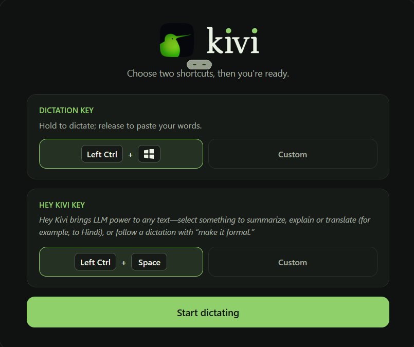

---

#### Test 02 — Technical Precision & Negative Constraints
* **Spoken Input:** *"Quick engineering note. In auth service dot T S, rename get user to fetch user, but do not change session token. The API returned HTTP four zero one three times between ten fifteen and ten seventeen A M. Retry only once, wait two hundred and fifty milliseconds, and log request ID Kivi dash three zero eight. The production database must not be modified. This is a proposal, not an approved change."*
* **Kivi Output:**
  ```text
  Quick engineering note: In authservice, rename gotUser to fetchUser but do not change the session token. The API returned HTTP 401 three times between 10:15 and 10:17 AM. Retry only once. Wait 250 milliseconds and log request ID.

  Kivi-308. The production database must not be modified. This is a proposal, not an approved change.
  ```
* **Analysis:** 100% preservation of all 4 negative constraints and epistemic status (*"proposal, not approved"*). Formatted `HTTP 401`, `10:15 and 10:17 AM`, `250 milliseconds`, and `Kivi-308`. Misheard `getUser` as `gotUser` and dropped `.ts` extension due to lack of codebase context. `Ctrl+Z` atomically undid the entire insertion.

---

### Group 2: Indic Code-Switching & Script Handling

#### Test 03 — Romanized Hinglish
* **Spoken Input:** *"Kal ka customer demo three thirty PM par hai. Priya login flow dikhayegi, aur Aaditya payment retry explain karega. Payment page Friday tak ready hogi—sorry, Thursday tak. Mujhe lagta hai ki humko production database touch nahi karna chahiye until the final approval arrives. Also, Slack update short rakhna, but please do not remove the warning about the expired session token."*
* **Kivi Output:**
  ```text
  Kal ka customer demo 3:30 PM par hai. Priya login flow dikhayegi aur Aditya payment retry explain karega. Payment page Thursday tak ready hogi.

  Mujhe lagta hai ki humko production database touch nahi karna chahiye until the final approval arrives. Also, Slack update short rakhna, but please do not remove the warning about the expired session token.
  ```
* **Analysis:** Zero unwanted English translation; zero forced Devanagari script. Natural Romanized Hinglish maintained. Resolved Friday to Thursday in Hindi grammar. Defaulted `Aaditya` to `Aditya`.

---

#### Tests 20 & 21 — Native Devanagari vs Manual Language Setting
* **Test 20 (Auto-Detect + Native Script):**
  > `कल का customer demo 3:30 PM पर है। क्रिया login flow दिखाएगी और payment API अभी ready नहीं है। Please production database को touch मत करना until Maya approves.`
  * *Finding:* Preserved English technical terms in Latin script. Corrupted proper name `Priya` into `क्रिया` (*kriya* = verb/action).
* **Test 21 (Manual Hindi Selected):**
  > `प्रिया और माया कस्टमर डेमो दिखाएंगे। प्रिया login flow एक्सप्लेन करेगी और माया payment API एक्सप्लेन करेगी। प्रोडक्शन डेटाबेस को टच मत करना।`
  * *Finding:* Correctly rendered `प्रिया` and `माया`. Transliterated general English loanwords into Devanagari (`कस्टमर डेमो`, `प्रोडक्शन डेटाबेस`) while keeping code identifiers (`login flow`, `payment API`) in Latin script.

---

### Group 3: Word-Level Memory & Dictionary

#### Tests 04, 05, 06 — The Phonetic Memory Journey
* **Test 04 (Passive Learning):** Manually editing `Aditya` to `Aaditya` in Notepad produced zero memory retention in subsequent takes.
* **Test 05 (Spoken Spelling):** Saying *"Aaditya—spelled A A D I T Y A"* worked within the utterance, but was completely forgotten 10 seconds later.
* **Test 06 (In-App Dictionary):**
  * Added term `Aaditya` with note in `dictionary` screen.
  * *First run:* 100% success (`3/3` occurrences spelled `Aaditya`).
  * *After restart:* Reverted 100% to `Aditya` (`0/3` occurrences). Visual entry remained in UI, but daemon failed to apply it.

| Teaching Aaditya in Dictionary | Saved Term in Dictionary |
|---|---|
| 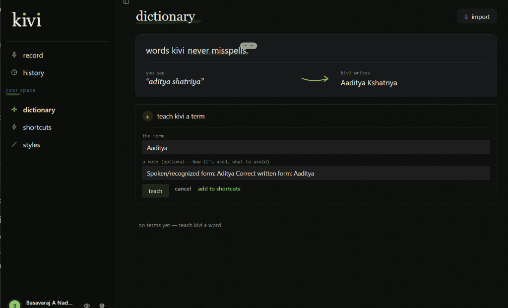 | 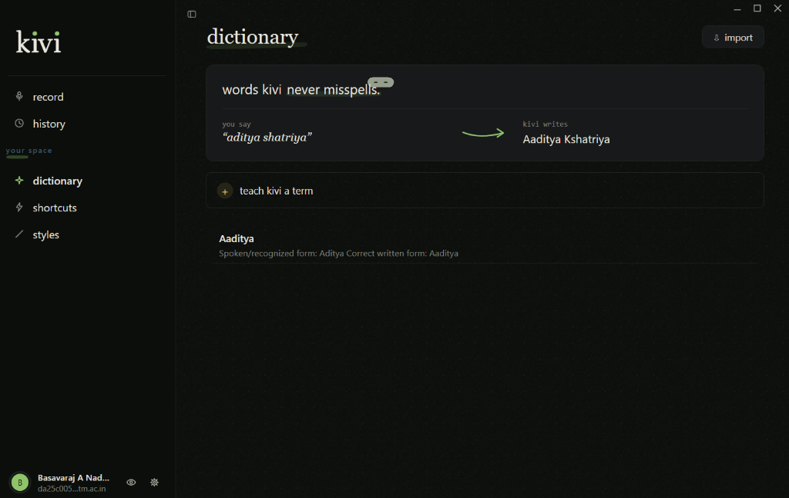 |

---

### Group 4: Styles, Presets & Custom Instructions

#### Tests 08 & 09 — Tone Compression & Prompt Adherence
* **Test 08 (Preset Comparison on identical speech):**
  * **Balanced (62 words):** Conversational lead-in (*"So for tomorrow's launch review..."*), full articles.
  * **Minimal (53 words, -15%):** Stripped filler and articles (*"Tomorrow's launch review: login screen is complete, payment API is still being tested..."*), used semicolons.
  * **Polished (60 words):** Formatted standalone markdown header followed by composed prose.
* **Test 09 (Custom System Prompt Injection):**
  * Instruction: *"Use a short heading followed by bullet points. Preserve uncertainty words such as 'might' and 'probably'. Keep numbers precise. End every take with '[DRAFT]'."*
  * Output:
    ```markdown
    Launch review update

    - The payment API might be ready by Thursday.
    - The auth service still returns HTTP 401.
    - Priya probably needs one more test.
    - Do not deploy anything to production until she approves it.

    [DRAFT]
    ```
  * Adherence: **100% (4/4)**.

| Styles Overview | Style Preset Editor | Custom Prompt Instructions |
|---|---|---|
| 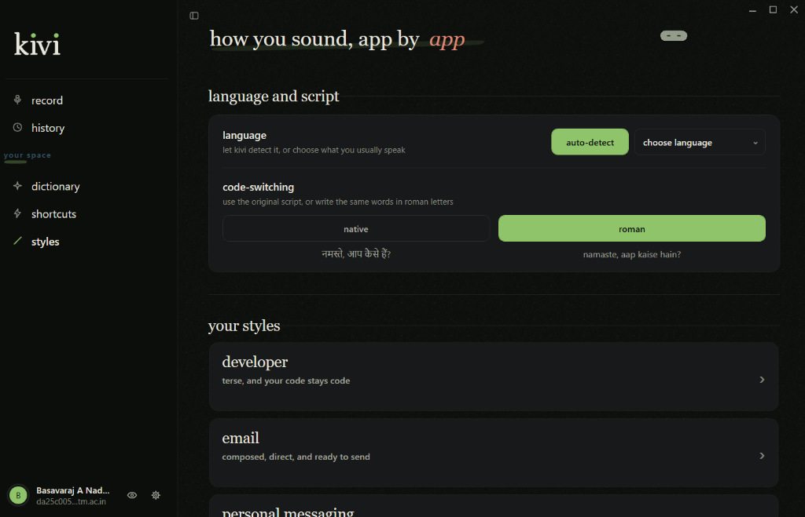 | 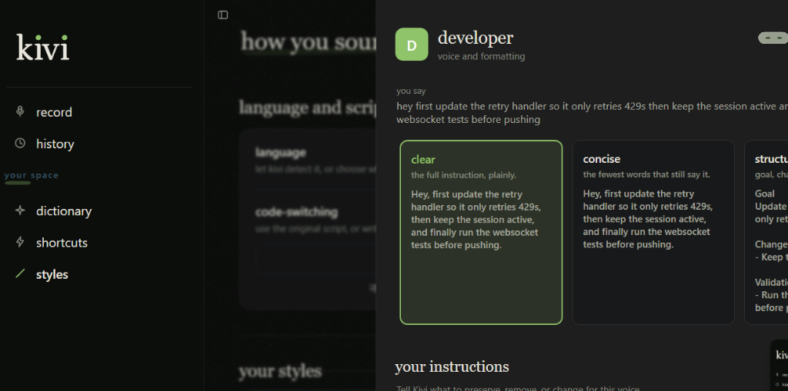 | 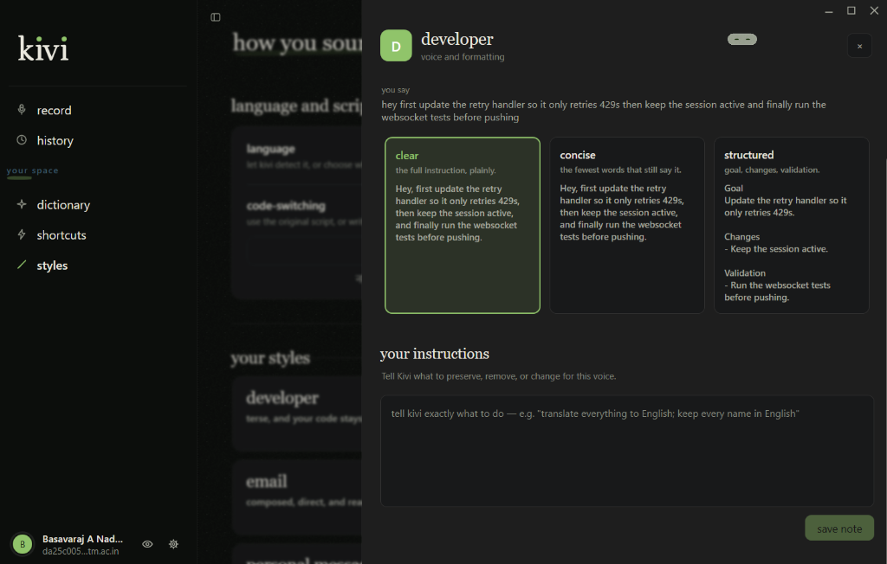 |

---

### Group 5: Shortcuts & Voice Macros

#### Tests 10 & 10B — Voice Expansion Breakdown
* Configured trigger `my Kivi test sign off` $\rightarrow$ 3-line signature block.
* Output: `My Kivi Test Sign-off.` (Literal transcription with title casing and hyphen).
* Verified: Feature is completely non-operational in the background dictation daemon.

| Shortcuts List (1 of 500 Active) | Shortcut Form Editor |
|---|---|
| 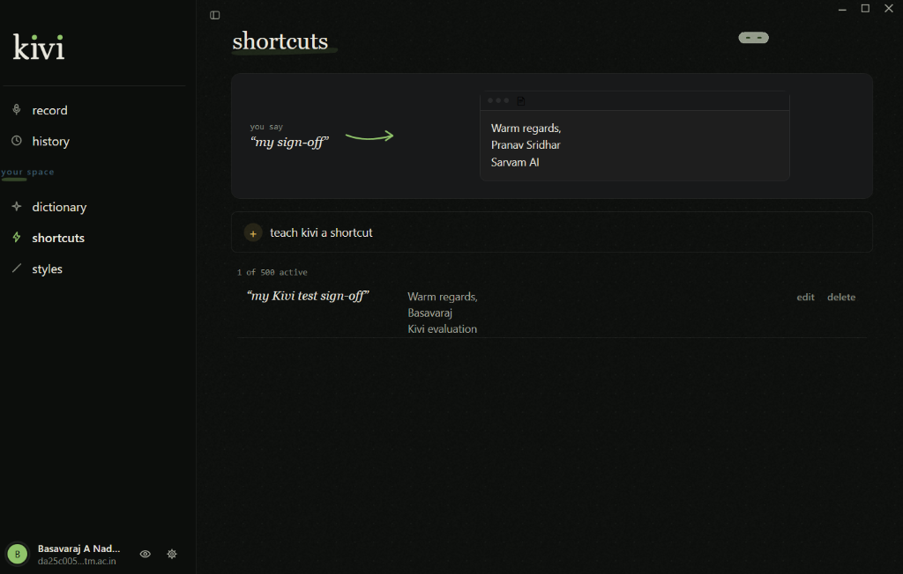 | 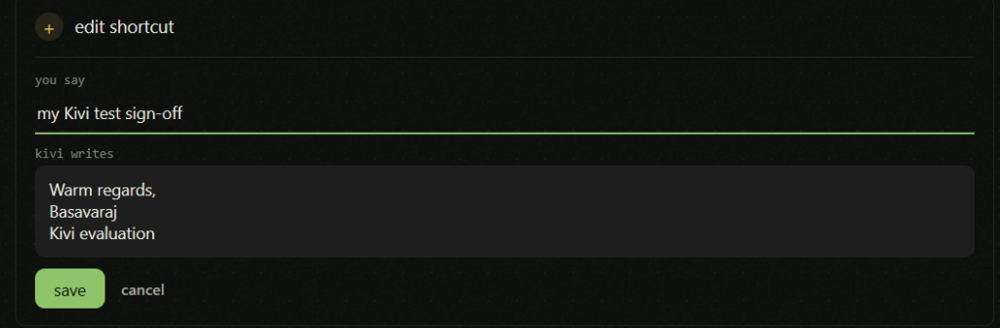 |

---

### Group 6: History Q&A RAG, Provenance & Context Contamination

#### Test 11 — Question Answering with Citations
* Query: *"What instructions did I dictate about the production database?"*
* Synthesized Answer:
  ```markdown
  - The **production database** must not be changed without approval. [1][2][3][4]
  - Priya will record Aditya's feedback without changing the **production database**. [5]
  - The **production database** should not be touched until final approval arrives. [6]
  - The **production database** must not be modified as it is a proposal and not an approved change. [7]
  ```
* Provenance: Listed all 7 supporting takes beneath the modal.

| History Q&A Synthesis | Citations and Supporting Takes |
|---|---|
| 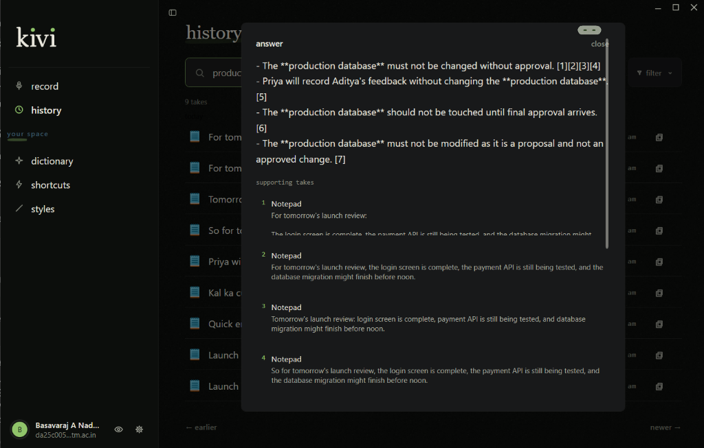 | 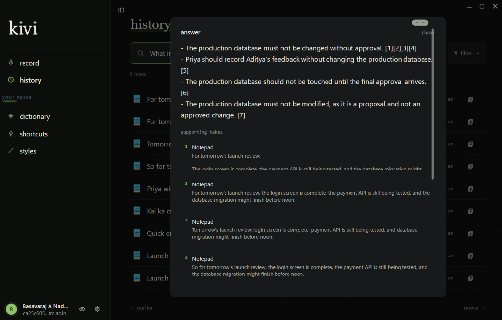 |

---

#### Test 12 — Grounded Abstention
* Query: *"Did Priya approve the production deployment?"*
* Output: **`couldn't find enough in your takes for that — here's what matches`**
* Result: Zero hallucination; refused to infer approval.

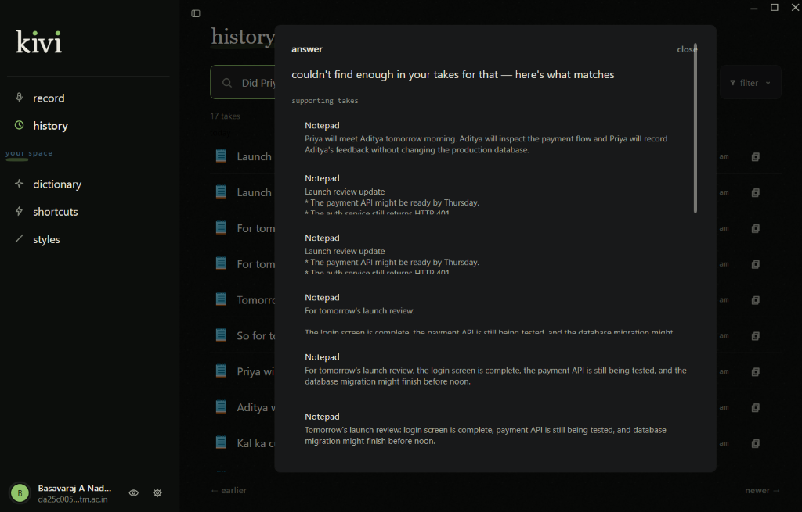

---

#### Test 13 — Contradiction & Latest-State Resolution
* Query: *"When is the latest confirmed Project Marigold review?"*
* Output: **`The latest confirmed schedule for the Project Marigold review is Thursday at 4 PM. [1]`**
* Result: Superceded obsolete Tuesday schedule, cited only the corrective take `[1]`.

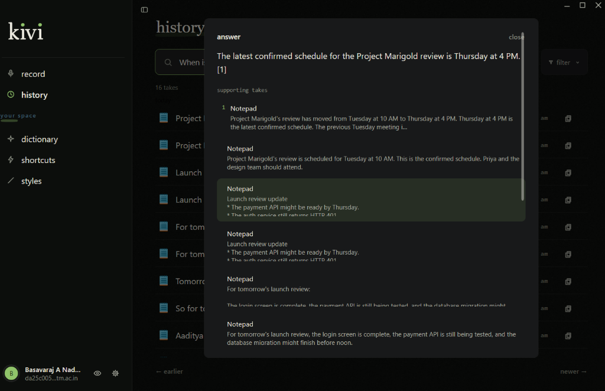

---

#### Tests 14, 15, 16 — Cross-Project Context Contamination
* **Test 14 (Multi-Take Fusion):** Cleanly combined schedule `[1]`, attendees `[2]`, and formatting rule `[3]`.
* **Test 15 (Context Drift Failure):** Asked for Cedar brief; returned Launch Review facts (`login screen`, `payment API`, `migration`) citing `[1][2][3][4]` from 10 takes prior.
* **Test 16 (Entity Leak Failure):** Asked scoped query: *"Using only Project Sedar takes..."*; leaked Aditya and Priya from Test 5 into Project Cedar's attendee list.

| Test 14: Multi-Take Synthesis | Test 15: Catastrophic Context Drift | Test 16: Entity Leakage |
|---|---|---|
| 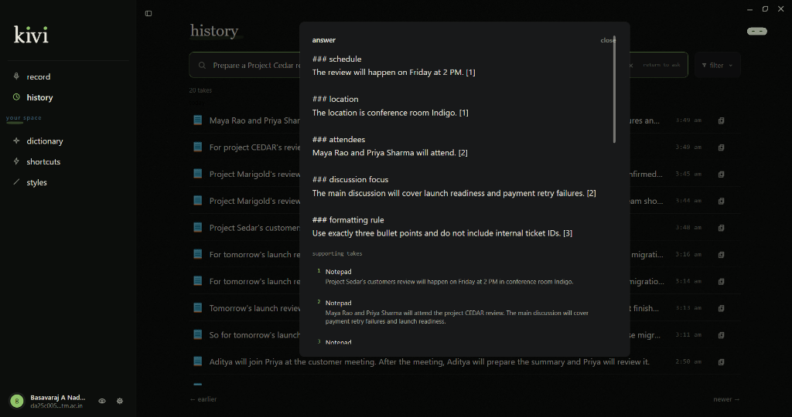 | 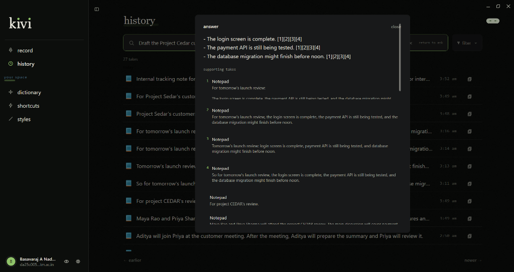 | 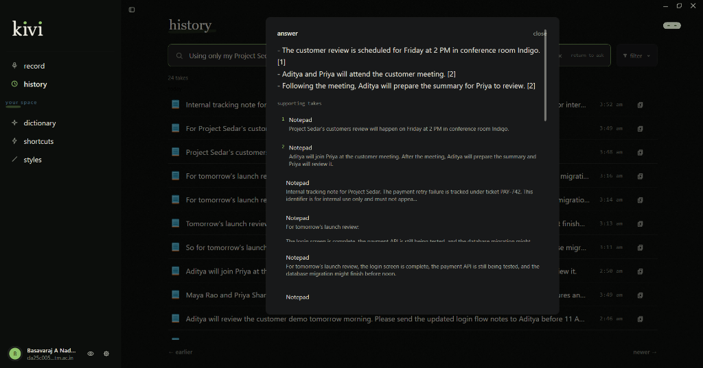 |

---

### Group 7: Hey Kivi Interactive Assistant (`Ctrl + Space`)

#### Tests 17, 18, 19 — Floating Card, Follow-Up & Clipboard Race Condition
* **Test 17 (Text Selection Transformation):** Rewrote raw rambling into 8-word executive draft:  
  `"The payment API may be ready by Thursday."` Stripped internal ticket `PAY-742`.
* **Test 18 (Multi-Turn Follow-Up):** Turn 2 added Maya's approval; Turn 3 tracked session pagination dots `[ • • ━ ]`.
* **Test 19 (User-Edit Authority & Double-Click Bug):**
  * Manually edited Thursday to Friday $\rightarrow$ Hey Kivi respected the manual edit in subsequent follow-ups.
  * **Discovered Bug:** Double-clicking to edit triggers `onClick` first, clobbering the user's OS clipboard!

| Test 17: Floating Preview | Test 18: Turn 2 Follow-Up | Test 18: Turn 3 Follow-Up | Test 18: Copied Toast | Test 19: User Edit Respected |
|---|---|---|---|---|
| 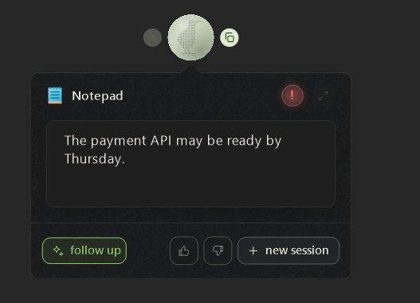 | 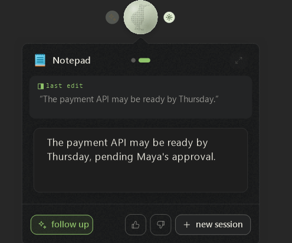 | 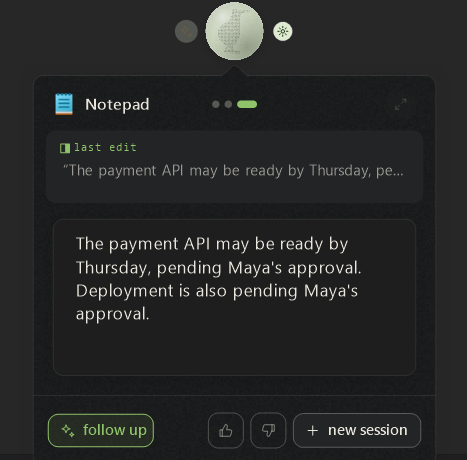 | 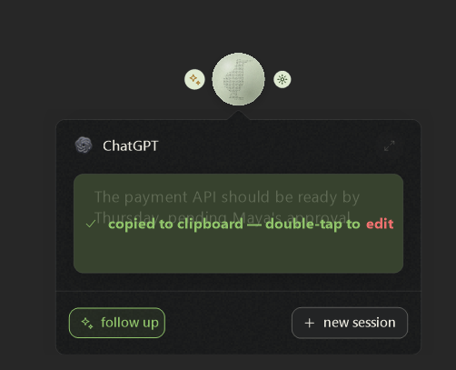 | 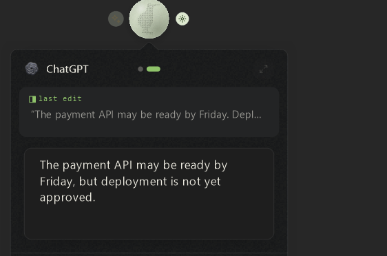 |

---

### Group 8: Network Resilience & Offline Behavior

#### Tests 22 & 23 — Cloud Dependency & Recovery
* **Test 22 (Offline):** Disconnecting Wi-Fi produces zero text; triggers terracotta banner: *"something failed — press L Ctrl + Win"*. Proves ASR/LLM is cloud-hosted.
* **Test 23 (Recovery):** Instant recovery upon reconnection; zero corrupted takes logged to History.

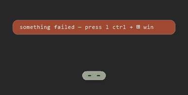

---

### Group 9: Deletion Hygiene & Permanent Ghost Memory

#### Tests 24, 25, 26 — The Ghost Memory Forensic Trail
* **Test 24:** Deleted take containing `blue 79` from History UI. Count dropped to 8. Asked for access code $\rightarrow$ Still answered `blue 79` citing deleted take `[1]`.
* **Test 25:** Rephrased question $\rightarrow$ Abstains in prose, but still returns the deleted take as the #1 supporting chunk.
* **Test 26:** Killed all processes via Task Manager; restarted Kivi; queried again $\rightarrow$ **Still answered `blue 79` [1]!** Proves deletion was never propagated to the backend search index.

| Before Deletion: Answer `blue 79` | Take Detail Drawer: Delete Action | Ghost Memory Answer Post-Delete | Permanent Ghost Memory Post-Restart |
|---|---|---|---|
| 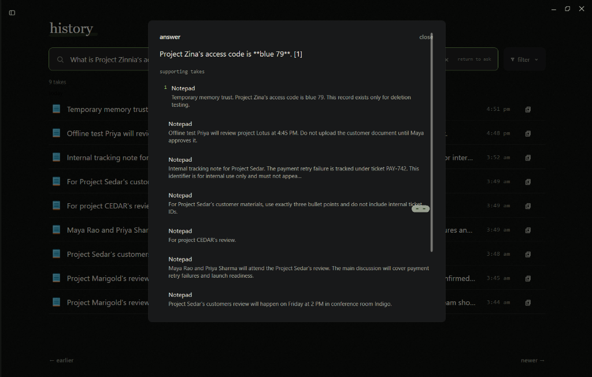 | 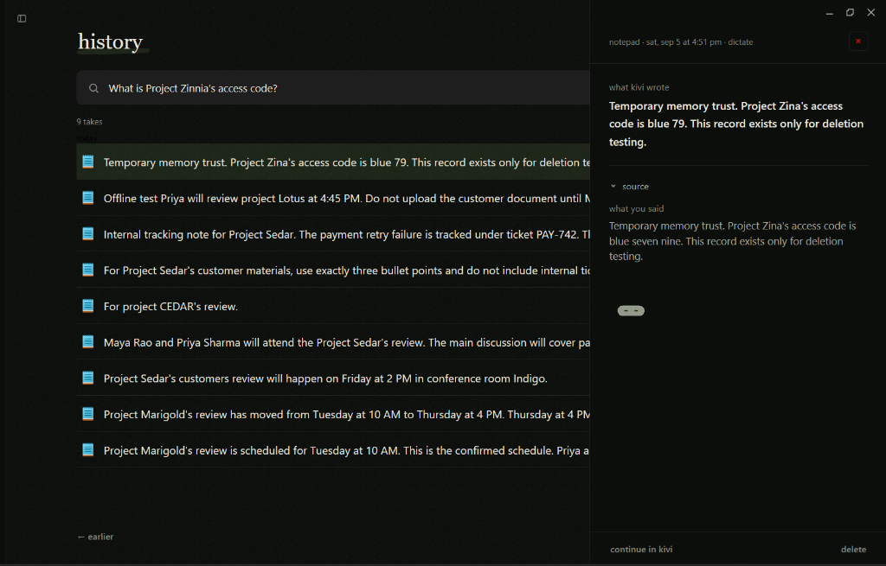 | 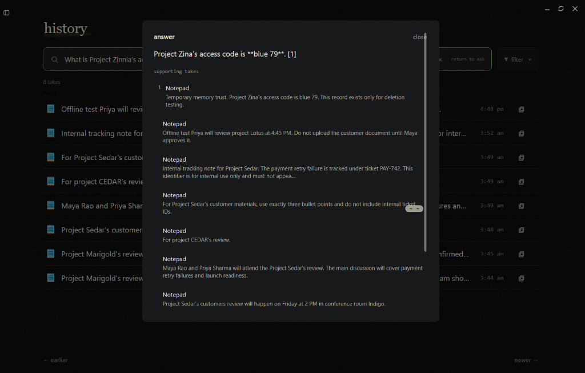 | 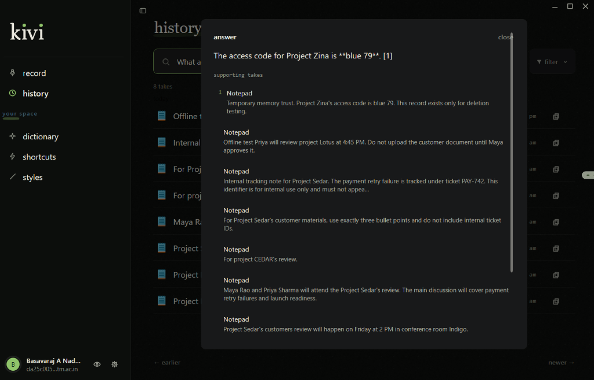 |

---

### Group 10: Desktop Lifecycle, Tray Menu, Position & Safety

#### Tests 27 to 32 — Operating System Integration
* **Test 27:** The Orb is explicitly designed as an *"always-present surface"* (remains active across minutes).
* **Test 28:** The `inactivity timeout` setting is currently a non-functional UI stub.
* **Test 29:** System tray right-click menu provides canonical `Exit` that terminates all UI and background daemon processes cleanly.
* **Test 30:** Setting position in `Settings → The Orb → Position` persists to lower screen across restarts.
* **Test 31:** Pressing `Esc` during dictation immediately aborts recording, pastes nothing, and writes zero takes.
* **Test 32:** `Ctrl+Shift+V` ("Paste last") does not resurrect cancelled speech; buffer is expunged.

| Windows System Tray Menu | Lower Position Persisted | The Orb Hover States |
|---|---|---|
| 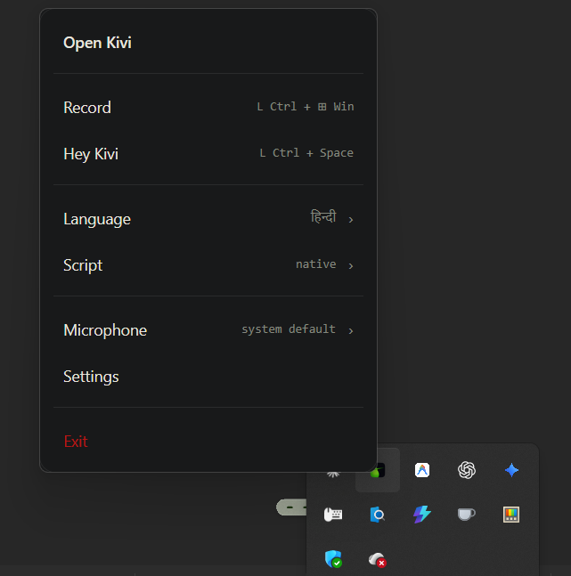 | 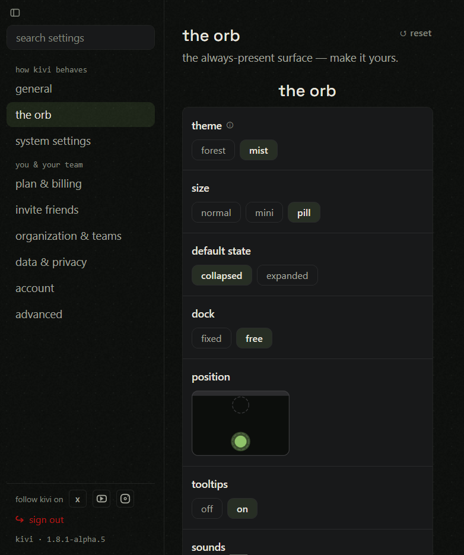 |  |

---

## 5. Architectural Blueprint for Golden Goose

Based on these 32 empirical tests, our **Golden Goose Semantic Memory Engine** directly targets and eliminates the failure modes discovered:

```
┌────────────────────────────────────────────────────────────────────────────┐
│                  GOLDEN GOOSE MEMORY ENGINE ARCHITECTURE                   │
├────────────────────────────────────────────────────────────────────────────┤
│                                                                            │
│  1. ATOMIC DELETION CASCADE (Fixes Defects 1 & 5)                          │
│     • Deleting a take executes a single transaction across SQLite AND the  │
│       Vector Index simultaneously. Zero "ghost memory" leaks.              │
│                                                                            │
│  2. 3-TIER MEMORY STRATIFICATION (Fixes Defect 4)                          │
│     • Tier 1: Episodic Traces (Timestamp, App, Raw Take).                 │
│     • Tier 2: Factual Knowledge (Entity, Attribute, State, Provenance).     │
│     • Tier 3: Communication Preferences (App-specific & Global).           │
│                                                                            │
│  3. ENTITY-SCOPED HYBRID RETRIEVAL (Fixes Defects 4 & 6)                   │
│     • Binds memories to entity graphs (`entity_id`).                       │
│     • Multi-stage filtering: BM25 Lexical + Cosine Embedding, strictly     │
│       bounded by entity scope. Prevents Project Cedar / Launch drift.       │
│                                                                            │
│  4. RADICAL PROVENANCE & STRICT ABSTENTION                                 │
│     • Every fact or brief cites exact Take ID and timestamp.               │
│     • Enforces epistemic humility: refuses when evidence is insufficient.  │
│                                                                            │
│  5. SEPARATED INTERACTION CANVAS (Fixes Defects 2 & 6)                     │
│     • Dedicated Copy and Insert buttons, eliminating clipboard clobbering. │
│                                                                            │
└────────────────────────────────────────────────────────────────────────────┘
```

---
*Dossier preserved and committed to repository.*
