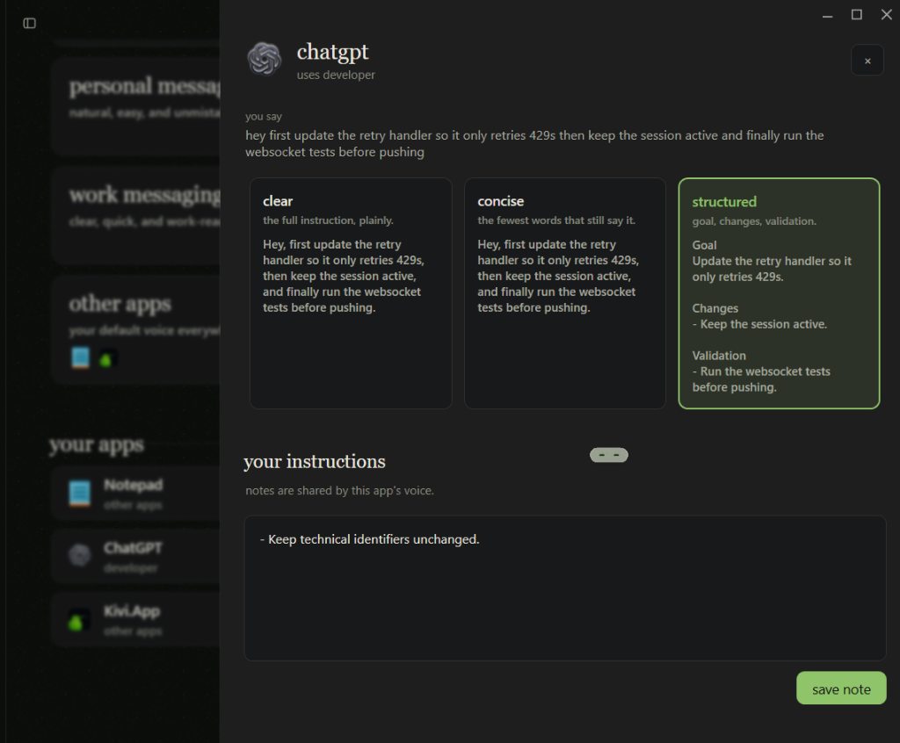
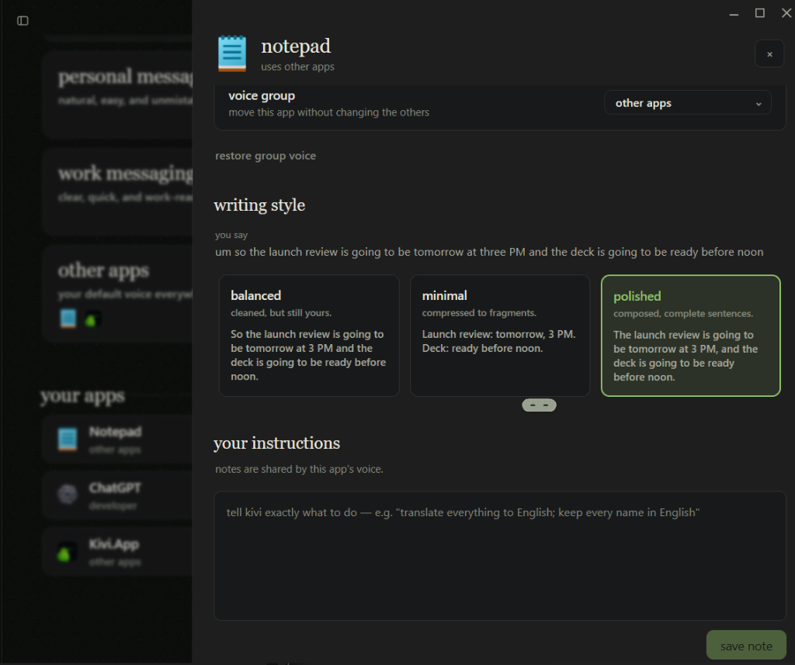
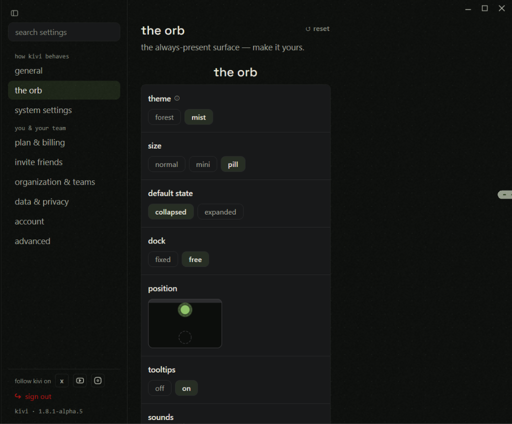

# Sarvam Kivi (Windows v1.8.1-alpha.5) Empirical Audit & Evaluation Dossier

> **Author / Candidate:** Basavaraj A Naduvinamani (`da25c005@smail.iitm.ac.in`)
>
> **Target Role:** Golden Goose ("The Things Kivi Comes to Know") / Backend-Focused Full Stack
>
> **Tested Binary:** `kivi-win-setup.exe` (version displayed in Settings: `1.8.1-alpha.5`)
>
> **Environment:** Windows 11 Desktop
>
> **Test record:** 46 numbered live test stages, including targeted retests and diagnostics

---

## 1. Purpose, scope, and evidence standard

This dossier records hands-on observations from the pre-release Windows build. It covers ordinary dictation, corrections, multilingual speech, Dictionary and Shortcuts, application-specific styles, History answers and supporting takes, Hey Kivi transformations, network loss, deletion, privacy controls, desktop lifecycle, and competing background speech.

Evidence is separated into:

- **Observed:** directly seen in Kivi output, UI state, screenshots, or repeatable interaction.
- **Interpretation:** a conclusion supported by an observation but not a claim about implementation.
- **Hypothesis to validate:** a possible engineering explanation requiring source code, logs, telemetry, API traces, or backend access.

Scores use a behavioural rubric: `2` = target behaviour passed, `1–1.5` = partial pass, and `0` = failed target behaviour. Audits and inconclusive checks are unscored. Results apply only to this Windows alpha session.

This is an empirical research artefact, not Part One positioning or vision prose.

## 2. Test environment

- Ordinary dictation: hold `Left Ctrl + Windows`, speak, and release to insert.
- Hey Kivi: `Left Ctrl + Space`.
- Typical successful online dictation latency: approximately one second after release.
- Successful dictation appeared as a batch after release, not progressively.
- Primary test applications: Windows Notepad and ChatGPT.
- Evidence screenshots are in [`screenshots/`](screenshots/).

## 3. Corrected scorecard

| # | Test | Directly observed result | Score | Status |
|---|---|---|---:|---|
| 01 | Baseline dictation | Removed filler and Friday→Thursday correction; preserved uncertainty, time, numbers, paragraphs, and list | 2.0 | Pass |
| 02 | Technical precision | Preserved negatives and numeric details; dropped `.ts` and changed `getUser` to `gotUser` | 1.0 | Partial |
| 03 | Roman Hinglish | Preserved mixed-language meaning, Roman script, time, correction, uncertainty, and warnings; `Aaditya` became `Aditya` | 1.5 | Partial |
| 04 | Passive post-edit learning | Manually changing `Aditya` to `Aaditya` did not affect later dictation | 0.0 | Fail |
| 05 | Spoken spelling | Explicit spelling worked in that take; later unprompted takes returned to `Aditya` | 1.0 | Partial |
| 06 | Dictionary persistence | Correction worked immediately and remained visible after restart, but was not enforced after restart | 1.0 | Partial |
| 07 | Interface exploration | Orb, Record, History, Dictionary, Shortcuts, Styles, app overlay, and language controls documented | — | Audited |
| 08 | Balanced / Minimal / Polished | Distinct formats preserved uncertainty and safety; one Balanced run changed `customer note` to `customer role` | 1.5 | Partial |
| 09 | Custom style instruction | Followed heading, bullets, uncertainty, identifier, and `[DRAFT]` ending | 2.0 | Pass |
| 10 | Shortcut expansion | Saved shortcut stayed active but exact and inline triggers were transcribed literally | 0.0 | Fail |
| 10B | Shortcut clean retest | With custom style removed and trigger normalized, shortcut still did not expand | 0.0 | Fail |
| 11 | History synthesis | Combined relevant production-database takes with citations; changed `will record` to `should record`; over-inclusive results | 1.5 | Partial |
| 12 | Unsupported approval question | Correctly said evidence was insufficient and showed related takes | 2.0 | Pass |
| 13 | Marigold reschedule | Chose Thursday 4 PM over cancelled Tuesday 10 AM and cited the correction | 2.0 | Pass |
| 14 | Distributed Cedar synthesis | Combined schedule, location, attendees, focus, and rule from three takes with mapped citations | 2.0 | Pass |
| 15 | Cedar customer brief | Returned unrelated launch-review facts | 0.0 | Fail |
| 16 | Scoped Sedar recovery | Recovered schedule/location and used three bullets, but imported unrelated people and omitted the real focus | 1.0 | Partial |
| 17 | Selected-text rewrite | Produced concise customer-safe text, retained uncertainty, and removed internal identifier | 2.0 | Pass |
| 18 | Hey Kivi follow-up | Retained payment API, Thursday, and Maya; first phrasing was ambiguous, later phrasing redundant | 1.5 | Partial |
| 19 | User-edited context | Preserved manual Friday correction, `may`, and unapproved deployment; edit interaction overwrote clipboard | 1.5 | Partial |
| 20 | Auto-detect + Native Hindi | Mixed scripts and preserved negatives; `Priya` became `क्रिया` | 1.5 | Partial |
| 21 | Manual Hindi + Native | Names correct; English transliteration inconsistent; spoken `dikhayengi` became `दिखाएंगे` | 1.5 | Partial |
| 22 | Offline dictation | No text; generic failure; failed take did not resume after reconnection | 0.0 | Fail |
| 23 | Reconnection recovery | A new take worked immediately without restart; failed offline attempt was absent from History | 2.0 | Pass |
| 24 | Delete then same query | Record left normal History, but answer still returned `blue 79` and the deleted source | 0.0 | Fail |
| 25 | Fresh query after deletion | Answer abstained, but deleted record appeared as first supporting take | 0.0 | Fail |
| 26 | Query after full restart | Deleted fact was answered and cited again; record stayed absent from normal History | 0.0 | Critical failure |
| 27 | Orb persistence | Orb stayed available for three minutes after main window closed; Settings calls it always-present | 2.0 | Pass |
| 28 | Two-minute inactivity setting | No visible effect after three minutes; no notification | 0.0 | No visible effect |
| 29 | Tray Exit | Removed orb and Kivi process completely | 2.0 | Pass |
| 30 | Saved orb position | Lower position persisted across complete restart and appeared there directly | 2.0 | Pass |
| 31 | Esc cancellation | Inserted no text, created no History record, and returned orb to idle | 2.0 | Pass |
| 32 | Paste Last after cancellation | Cancelled Quartz content did not appear, but clipboard text pasted; cancellation buffer could not be isolated | — | Inconclusive |
| 33 | Controlled Paste Last | `Ctrl+Shift+V` pasted clipboard sentinel instead of the Nimbus take | 0.0 | Fail |
| 34 | Six-second pause | Stayed listening, waited for release, chose final 10:15 time, and preserved constraint | 2.0 | Pass |
| 35 | High-density dictation | Applied date correction and four-item list; `Banyan→Panyan`, `Maya Rao→Mayarao`, `approved→approval` | 1.5 | Partial |
| 36 | App style isolation | Notepad and ChatGPT used separate formats and tags with no observed cross-tag leakage | 2.0 | Pass |
| 37 | Cross-app provenance | Selected Thursday 4 PM correction and identified ChatGPT as its application | 2.0 | Pass |
| 38 | Rejected vs approved action | Ignored quoted rejected deletion and returned log archiving after Maya confirms | 2.0 | Pass |
| 39 | Protected-term translation | Preserved Project Willow, Maya, Production Database, quotation, rejection, and condition | 2.0 | Pass |
| 40 | Data & Privacy screen | Recorded current toggle states and audio statement; defaults and backend implementation not established | — | Audited |
| 41 | Screen context comparison | ON identified Notepad but could not read unselected code; OFF also failed and showed Kivi, partly confounding comparison | 1.0 | Partial diagnostic |
| 42 | Silent Hey Kivi abort | Listened, then collapsed with no answer or error; later self-recovered | 0.0 | Fail |
| 43 | Health check | Dictation and selected-text Hey Kivi both worked without restart | 2.0 | Pass |
| 44 | Final unselected-context check | With context ON and Notepad active, listened then silently collapsed; System Settings showed mic controls only | 0.0 | Fail in tested scenario |
| 45 | Kannada code-switching | Preserved Kannada grammar, Latin technical terms, names, time, and prohibition in the sample | 2.0 | Pass |
| 46 | Competing speech | Perfect when background was quieter; many errors when background became equal/slightly louder | 1.5 | Conditional pass |

## 4. Detailed findings

### 4.1 Dictation, correction, and dense speech

Baseline dictation removed filler, resolved Friday→Thursday, preserved uncertainty, formatted a time and a three-item list, and inserted only after release. Ctrl+Z removed the entire insertion.

Technical dictation retained safety language and numbers but lost `.ts` and changed `getUser` to `gotUser`, showing a meaningful limitation for code identifiers.

Kivi stayed listening through a six-second silent pause and correctly selected 10:15 over the earlier 9:15. In the long Banyan passage, it applied the date correction and structured four items, but produced `Panyan`, `Mayarao`, and `approval launch schedule`.


### 4.2 Multilingual speech

Roman Hinglish preserved code-switching, uncertainty, correction, and negative instructions; `Aaditya` became `Aditya`.

Auto-detect + Native Hindi produced:

```text
कल का customer demo 3:30 PM पर है। क्रिया login flow दिखाएगी और payment API अभी ready नहीं है। Please production database को touch मत करना until Maya approves.
```

It preserved technical phrases and negations but changed `Priya` to `क्रिया`.

Manual Hindi + Native produced correct `प्रिया` and `माया`, but transliterated some English terms while leaving others Latin and changed the spoken grammatical form.

Kannada Native mode produced:

```text
ನಾಳೆಯ customer demo ಮಧ್ಯಾಹ್ನ 3:30ಕ್ಕೆ ಇದೆ. Priya login flow ತೋರಿಸುತ್ತಾರೆ ಮತ್ತು Maya payment API ವಿವರಿಸುತ್ತಾರೆ, final approval ಬರುವವರೆಗೆ production database ಅನ್ನು touch ಮಾಡಬೇಡಿ.
```

This sample preserved Kannada morphology, Latin technical terms, names, time, and prohibition. It does not establish general performance across all Kannada speech.

### 4.3 Learning, Dictionary, and Shortcuts

Manual text correction did not become a learned preference. Explicit spoken spelling worked in the current utterance only.

The `Aaditya` Dictionary entry stayed visible after restart, but later dictation returned to `Aditya`.

| Teaching Aaditya | Saved entry |
|---|---|
|  |  |

A phrase shortcut stayed listed as active, but exact and inline triggers returned literal text instead of the configured expansion.

| Active shortcut | Shortcut editor |
|---|---|
|  |  |

### 4.4 Styles and app-specific voices

Balanced, Minimal, and Polished created distinct formats and generally preserved uncertainty and safety. One Balanced run changed `customer note` to `customer role`.

The custom style instruction passed all requested behaviours: heading, bullets, uncertainty, identifier, and `[DRAFT]` ending.

In Test 36, Notepad used Balanced prose and `[NOTEPAD]`; ChatGPT used Developer Structured sections and `[CHATGPT]`. No opposite tag appeared. This demonstrates configured separation in that test, not the internal routing mechanism.

Post-audit, style persistence failed:

- ChatGPT stayed on Structured after attempts to switch to Clear.
- Selecting Clear did not expose Save.
- A cleared instruction reappeared.
- Notepad could show Polished but later reopen on Balanced.

| ChatGPT stale state | Notepad rollback |
|---|---|
|  |  |

### 4.5 History answers and provenance

The production-database answer combined several recorded constraints and showed numbered evidence. One statement shifted from `will record` to `should record`, and the supporting list was over-inclusive.

| Answer | Supporting takes |
|---|---|
|  |  |

Kivi correctly abstained when asked whether Priya approved production deployment.


For Marigold, it selected Thursday 4 PM over the cancelled Tuesday 10 AM schedule and cited the correction.


Test 14 correctly joined schedule/location, attendees/focus, and a formatting rule from three Cedar/Sedar takes. Test 15 then returned unrelated launch-review facts for a Cedar brief. Test 16 recovered schedule/location but imported unrelated Aditya/Priya facts and omitted the actual attendees and focus.

| Distributed synthesis | Context drift | Entity contamination |
|---|---|---|
|  |  |  |

Cross-app retrieval correctly selected the Thursday 4 PM ChatGPT correction, marked Tuesday cancelled, and named ChatGPT as the source application.


Kivi also correctly distinguished a rejected quoted database-deletion suggestion from the only approved action: archive logs after Maya confirms.


The take-detail drawer visibly separated `what Kivi wrote` from `what you said`. Some supporting takes retained spoken corrections or superseded details removed from final inserted text. This establishes two visible representations, not their internal storage design.

### 4.6 Hey Kivi

Selected-text rewriting produced a concise, customer-safe preview, retained uncertainty, and removed `PAY-742`.

Follow-up retained prior context, though one phrasing ambiguously attached Maya's approval to API readiness. A manual Friday edit then became authoritative; the next rewrite retained Friday, `may`, and unapproved deployment.

| Preview | Follow-up | User edit respected |
|---|---|---|
|  |  |  |

A single click copied the answer while double-click entered editing. The first click of a double-click overwrote the existing clipboard before the user could paste. No explicit Save appeared; Follow up implicitly committed the edit.

The Hindi translation preserved protected Latin terms, quotation, rejected status, and the Maya confirmation condition.


### 4.7 Connectivity

With networking disconnected, dictation produced no output and showed a generic failure banner. The failed take did not appear after reconnection and was absent from History. After networking returned, a new take worked immediately without restarting.

**Supported interpretation:** this build requires network availability for successful ordinary dictation.

**Not established:** which component requires it, where inference runs, whether audio is uploaded, or the internal ASR/LLM architecture.


### 4.8 Deletion and retrievable memory

The deletion sequence was:

1. A fictional take containing `blue 79` was created and retrieved.
2. The detail drawer showed written/source text and Delete; deletion required confirmation.
3. The record disappeared from normal History.
4. The same query still returned `blue 79` with the deleted source.
5. A new paraphrased query abstained but displayed the deleted source first.
6. After full process exit and restart, another fresh query again answered and cited `blue 79`.

| Before | Detail | After deletion | After restart |
|---|---|---|---|
|  |  |  |  |

**Observed conclusion:** visible deletion did not remove or exclude the record from History retrieval during these tests, including after restart.

**Not established:** whether the retained representation was local, cached, remote, synchronized, or another layer.

### 4.9 Windows lifecycle and shortcuts

- Closing the main window left the always-present orb running.
- Three minutes of orb inactivity caused no visible change.
- Tray Exit removed the orb and observed Kivi process.
- The configured lower position persisted across restart.
- Esc cancellation inserted nothing and created no History take.
- The two-minute inactivity setting caused no visible effect after three minutes; its intended scope was not documented.
- A controlled Paste Last test inserted the clipboard sentinel rather than the Nimbus take. The implementation cause was not established.

| Tray menu | Position | Orb settings |
|---|---|---|
|  |  |  |

### 4.10 Screen context and silent abort

With Screen context ON, Kivi identified Notepad but could not read visible unselected text. With it OFF, it also failed, though Kivi rather than Notepad was shown as active, partly confounding the comparison.

In a final ON test, Kivi detected Notepad, listened, then silently collapsed without an answer or error. System Settings showed microphone controls but no separate screen-context diagnostics. Selected-text Hey Kivi worked between these failures.

**Observed conclusion:** Kivi did not read unselected Notepad text in the tested scenarios.

**Not established:** the intended scope of Screen context, support on other platforms, the active-app label difference, the internal failure cause, or the meaning of the red exclamation icon.

| Context ON | Context OFF | Silent collapse | System Settings |
|---|---|---|---|
|  |  |  |  |

### 4.11 Data & Privacy screen

At capture time, the UI showed:

- Screen context: ON
- Keep my memory on this device only: OFF
- Retry failed dictations: ON
- Don't use dictation data to train AI models: OFF
- Apply zero data retention policy: OFF
- `audio is processed in real time and never stored on our servers.`

These are observed account states, not established product defaults. The test did not establish retention duration, organization-policy semantics, remote storage of derived text/embeddings, or a relationship between these toggles and the deletion defect.

The negative training-toggle wording requires policy/documentation evidence before a definitive consent conclusion. Zero retention being OFF does not establish indefinite retention.


### 4.12 Competing speech

When the user's voice was louder, Kivi preserved Monday 11 AM, `Deployment is not approved`, and Priya, with no background claims. At equal/slightly louder background volume, the user observed many errors. The corrupted output was not saved, so this remains qualitative rather than a word-level measurement.

The result does not establish the presence or absence of beamforming, dereverberation, diarization, SNR telemetry, or another audio technique.

## 5. Corrected defect register

| Defect | Severity | Observed evidence | Requirement suggested by evidence |
|---|---|---|---|
| Deleted record remained retrievable | Critical | Tests 24–26, including restart | Remove/exclude every retrievable representation and verify completion |
| Cross-project contamination | High | Tests 15–16 | Enforce entity/project scope and expose conflicts |
| Style/instruction changes did not persist | High | Post-audit screenshots | Explicit saved state, reliable reset, persistence verification |
| Double-click edit overwrote clipboard | High | Test 19 | Separate Copy and Edit; do not mutate clipboard on edit |
| Saved phrase shortcut did not expand | Medium–High | Tests 10/10B | Validate trigger end-to-end and surface match feedback |
| Paste Last failed in Notepad | Medium–High | Test 33 | Detect conflicts, allow rebinding, confirm insertion |
| Dictionary entry not applied after restart | Medium | Test 06 | Verify effective dictionary state after startup |
| Hey Kivi silently aborted | Medium | Tests 42/44 | Show actionable error/retry instead of silent collapse |
| History answer could not be copied | Medium | Test 16 interaction | Add Copy/Insert and standard selection |
| Citation did not navigate to source | Medium | Test 24 workflow | Open the exact supporting take |
| Inactivity timeout had no visible effect | Low–Medium | Test 28 | Explain scope and activation |
| Raw Markdown appeared | Low | Literal `**` and `###` in screenshots | Render formatting or return plain text |
| Scrollbar crowded Close | Low | History answer screenshots | Reserve layout space |

### Hypotheses requiring implementation evidence

Plausible investigation directions—not established root causes—include:

- one or more retrievable layers may not be invalidated on deletion;
- contamination may arise in retrieval, entity resolution, query interpretation, or answer synthesis;
- style rollback may involve app overrides and shared voice-group state;
- Paste Last may be unregistered, overridden, or conflicting with application/OS handling;
- Dictionary data may be visible in settings but absent from the effective post-restart path;
- silent collapse may involve missing context, transient client/service state, or another unreported error.

Confirming these requires source code, logs, telemetry, API traces, or controlled backend access.

## 6. Product and engineering requirements supported by evidence

These are derived requirements, not claims about Kivi's internal architecture:

1. Deleting a take must make it unavailable to normal History, semantic retrieval, evidence panels, caches, and synchronized copies within a defined period.
2. Answers should link to exact takes, applications, timestamps, and relevant excerpts.
3. Corrections, cancelled facts, rejected ideas, proposals, uncertainty, and approvals must remain distinguishable.
4. A query scoped to one project/person must not silently import facts from a similar meeting.
5. Manual edits and deleted instructions must override earlier generated or saved states.
6. Names, filenames, symbols, ticket IDs, and code identifiers need confirmation/correction paths.
7. Insufficient or conflicting evidence should produce an explicit abstention.
8. Network, context, and generation failures need visible recovery actions.
9. Storage location, retention, training use, and control scope must be explained.
10. App-specific voices require reliable isolation and verifiable saved configuration.

No particular database, embedding model, indexing library, storage topology, or local/cloud architecture is established or prescribed by this audit.

## 7. Overall empirical assessment

The Windows alpha demonstrated a fast voice-to-text workflow with strong semantic cleanup, corrections, Roman Hinglish, Kannada code-switching, selected-text transformations, application-specific formatting, cross-app provenance, and decision-status reasoning.

The most consequential observed risks were retrievable data after visible deletion, cross-project fact contamination, inconsistent proper nouns/identifiers, and unreliable persistence of styles/instructions. Phrase shortcuts, Paste Last, the inactivity setting, and unselected screen context did not work as expected in the tested scenarios.

The evidence supports designing semantic memory around provenance, explicit state, complete deletion, entity scoping, user correction, and principled abstention. It does not support claims about undisclosed internal implementation.

---

*Dossier maintained in the repository with its supporting screenshots.*
